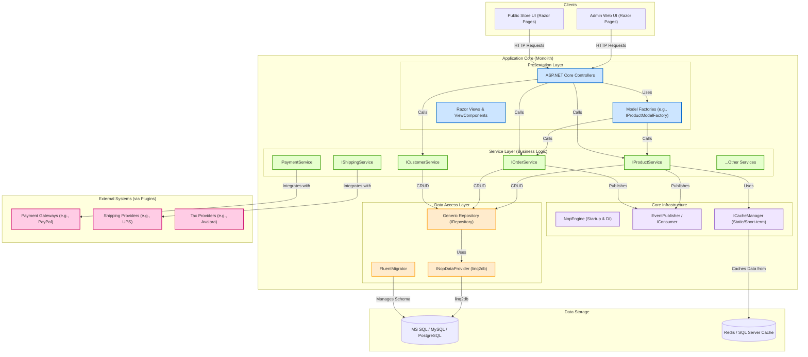
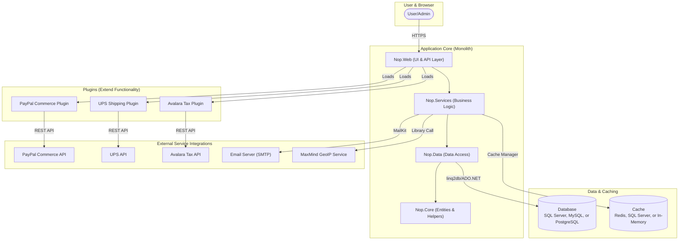
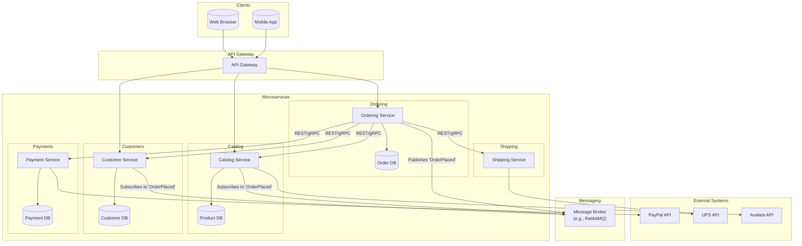

## Executive Summary

This report provides a comprehensive analysis of the nopCommerce application, focusing on its current monolithic architecture and a proposed migration strategy to microservices. It combines insights from a general enterprise analysis and a specific microservices decomposition analysis to provide a holistic view of the application and its potential evolution.

## Application Overview

*   Application Name: nopCommerce-develop
*   Application Purpose: Full-featured e-commerce platform
*   Technology Stack: .NET 9, ASP.NET Core, linq2db, Autofac
*   Architecture: Layered Modular Monolith
*   User Roles: Shopper, Store Administrator, Vendor
*   Key Processes: Order Placement, Order Fulfillment, Product Management
*   Integration Patterns: Payment Gateways, Shipping Providers, Tax Calculation Services

## Architectural Analysis

### Architectural Style

The nopCommerce application follows a layered modular monolith architecture.

*   **Evidence:** The project structure is divided into `Libraries` (Core, Data, Services) and `Presentation` (Web, Web.Framework). The `NopEngine.cs` class orchestrates service registration and startup. The extensive use of plugins demonstrates a highly modular and extensible design.
*   **Impact:** This style offers simplicity in development and deployment. The pluggable nature mitigates some of the rigidity of a traditional monolith.
*   **Recommendation:** Maintain the modular monolith style. For future scalability needs, consider identifying bounded contexts that could be extracted into separate services.

### Technology Stack

*   **Backend:** .NET 9, ASP.NET Core (`Dockerfile`, `Nop.Web.csproj`).
*   **Database:** Multi-DB support for MS SQL Server, MySQL, and PostgreSQL (`Nop.Data.csproj`).
*   **Data Access:** `linq2db` is used as the data access library, with `FluentMigrator` for database migrations (`Nop.Data.csproj`).
*   **Dependency Injection:** Autofac is the configured DI container (`Program.cs`).
*   **Caching:** Supports in-memory, Redis, and SQL Server distributed caching (`Nop.Core.csproj`).
*   **Presentation:** ASP.NET Core MVC with Razor Views.

### Design Principles

*   **Layered Architecture:** Clear separation between Presentation (`Nop.Web`), Services (`Nop.Services`), and Data (`Nop.Data`) projects.
*   **Dependency Injection:** Services are registered in `Nop.Web.Framework\Infrastructure\NopStartup.cs` and injected into controllers and other services (e.g., `ProductController.cs` constructor).
*   **Repository Pattern:** The `IRepository<T>` interface and `EntityRepository<T>` class provide a generic abstraction for data access.
*   **Plugin Architecture:** The `IPlugin` interface and `PluginManager` class enable extending the system with new payment methods, shipping providers, etc., without modifying the core codebase.
*   **Event-Driven Messaging:** The `IEventPublisher` and `IConsumer<>` interfaces are used for decoupling components.

### Component Architecture Analysis

*   **Nop.Core:** Contains core domain entities (`Product.cs`, `Order.cs`), infrastructure interfaces (`IEngine`, `IWorkContext`), caching, and helper classes.
*   **Nop.Data:** Implements data access logic. Contains the generic `EntityRepository<T>`, data provider implementations, and database migrations using `FluentMigrator`.
*   **Nop.Services:** Contains the business logic of the application. Services like `OrderProcessingService.cs` and `ProductService.cs` orchestrate operations, interact with repositories, and publish events.
*   **Nop.Web.Framework & Nop.Web:** The presentation layer. `Nop.Web.Framework` contains base controllers, filters, model factories, and other reusable web components. `Nop.Web` contains the specific controllers, views, and startup configuration for the public store and admin area.

## Dependency Graphs

### Complete Application Architecture Graph

### Logical Dependencies Diagram

## Technology Matrix

| Technology Category | Technology | Version | Repositories Using | Support Status | Migration Urgency |
|-------------------|------------|---------|-------------------|----------------|-------------------|
| Languages | .NET | 9 | nopCommerce | Current | Not Applicable |
| Frameworks | ASP.NET Core |  | nopCommerce | Current | Not Applicable |
| Databases | MS SQL, MySQL, PostgreSQL |  | nopCommerce | Current | Not Applicable |
| Web Tech | ASP.NET Core MVC, Razor Views |  | nopCommerce | Current | Not Applicable |
| Third-party Libraries | Autofac, AutoMapper, linq2db, FluentMigrator |  | nopCommerce | Current | Not Applicable |

## Security Analysis

*   Authentication Methods: Cookie-based sessions, Multi-factor authentication (plugin-based)
*   Security Vulnerabilities:
    *   Encryption Key Management
    *   Plugin Vulnerabilities
    *   Permissive Content Security Policy (CSP)
*   Data Handling: Sensitive data, particularly payment information, is encrypted before persistence.
*   Access Controls: Access to administrative functions is controlled by a permission-based system.

## Application Startup and Flow Analysis

*   Startup Method: The `NopEngine.cs` and `NopStartup.cs` files orchestrate service registration and middleware configuration, using Autofac as the dependency injection container.
*   Dependencies Required: The application requires a database (MS SQL, MySQL, or PostgreSQL), a .NET 9 runtime, and the dependencies specified in the `.csproj` files.
*   Processing Flow: A typical flow is: Controller receives a request -> calls a Service -> Service retrieves/updates entities via Repository -> Repository interacts with the database.
*   Trigger Mechanisms: The application is triggered by HTTP requests to the controllers.
*   Data Flow Direction: Input sources -> Controllers -> Services -> Repositories -> Database

## Business Process Analysis

*   Process Names:
    *   Order Placement Workflow
    *   Order Fulfillment Workflow
    *   Administrator Product Management
*   User Roles:
    *   Shopper (Customer)
    *   Store Administrator
    *   Vendor

## Integration Patterns

*   API Endpoints: The system exposes a RESTful API through the `Nop.Plugin.Api` plugin. Internal APIs for frontend AJAX calls are implemented as controller actions returning `JsonResult`.
*   Database Connections: The system supports multiple database backends, including SQL Server, MySQL, and PostgreSQL.
*   External Services: The system integrates with external services through plugins. Examples include PayPal for payment processing, UPS for calculating shipping rates, and Avalara for tax calculations.

## Monolith to Microservices Migration Strategy

### Executive Summary

The nopCommerce application is a well-structured, feature-rich e-commerce monolith built on ASP.NET Core. Its N-Layer architecture and robust plugin system provide clear separation of concerns and high extensibility. While the shared database represents a point of high coupling, the modular design of the service layer offers clear seams for a phased migration to a microservices architecture. Key domains such as Catalog, Orders, and Customers are logically distinct, making them prime candidates for extraction into independent services.

### Analysis

#### Finding 1: Clear Domain-Driven Service Boundaries

The application is organized around distinct business domains, each with its own set of services, which provides a strong foundation for microservice decomposition.

*   **Evidence**:
    *   The solution is divided into projects that map to architectural layers (`Nop.Core`, `Nop.Data`, `Nop.Services`, `Nop.Web`).
    *   The `Nop.Services` project contains interfaces and implementations for specific business domains, such as `IProductService`, `IOrderProcessingService`, `ICustomerService`, and `IShippingService`.
    *   Domain entities are clearly defined in `Nop.Core.Domain` (e.g., `Product.cs`, `Order.cs`, `Customer.cs`), corresponding to these services.
*   **Impact**: This clear separation of concerns significantly de-risks the initial analysis phase of a microservices migration. It allows architects to identify service boundaries with high confidence, mapping them directly to existing business domains.
*   **Recommendation**:
    *   Decompose the monolith along these existing service boundaries.
    *   Proposed microservices include:
        1.  **Catalog Service**: Manages products, categories, and manufacturers.
        2.  **Ordering Service**: Manages shopping carts, orders, and shipments.
        3.  **Customer Service**: Manages customer accounts, addresses, and roles.
        4.  **Payment Service**: A facade for payment plugins, handling payment processing.
    *   Start the migration with the **Catalog Service**, as it is primarily a read-heavy service and has fewer transactional dependencies compared to the Ordering service.

#### Finding 2: High Data-Layer Coupling via Shared Database

All services share a single database and use a common repository pattern, creating tight coupling at the data layer. This is the most significant challenge for a microservices migration.

*   **Evidence**:
    *   The `docker-compose.yml` file defines a single database service (`nopcommerce_database`) for the entire application.
    *   The `Nop.Data` project provides a generic `IRepository<T>` (`IRepository.cs`) and `EntityRepository<T>` (`EntityRepository.cs`) used by all services to access data.
    *   There is no separation of data contexts; any service can potentially access any table. For example, `ProductService.cs` directly queries `ProductCategoryRepository` and `ProductManufacturerRepository`.
*   **Impact**: A shared database prevents true service independence. Any schema change can impact multiple services, and it's impossible to scale or deploy services' data tiers independently. Direct data access must be replaced by API calls between services.
*   **Recommendation**:
    *   Adopt the **Strangler Fig Pattern** for data migration.
    *   For the first extracted service (e.g., Catalog Service), create a new, dedicated database.
    *   Implement data synchronization between the monolith's database and the new microservice's database.
    *   Gradually redirect read operations to the new microservice's API.
    *   Finally, move write operations to the new service and decommission the monolith's corresponding tables. This must be done service by service.

#### Finding 3: Synchronous, In-Process Communication

Services communicate via direct, synchronous method calls within the same process, leading to tight runtime coupling.

*   **Evidence**:
    *   The `OrderProcessingService` in `OrderProcessingService.cs` directly injects and calls methods on `IProductService` (e.g., `AdjustInventoryAsync`), `IPaymentService`, and `IWorkflowMessageService`.
    *   The dependency graph shows a web of synchronous calls: `CheckoutController` -> `IOrderProcessingService` -> `IShoppingCartService` -> `IProductService`.
*   **Impact**: This synchronous coupling makes it difficult to extract services without significant refactoring. A failure in one service (e.g., `ProductService`) can cause a cascading failure that brings down the entire order placement process.
*   **Recommendation**:
    *   Introduce an **event-driven architecture** to decouple services.
    *   Extend the existing `IEventPublisher` to use a message broker (like RabbitMQ or Azure Service Bus).
    *   Refactor synchronous calls into asynchronous, event-based communication. For example:
        *   **Current**: `OrderProcessingService` calls `productService.AdjustInventoryAsync()`.
        *   **Proposed**: `OrderProcessingService` publishes an `OrderPlacedEvent`. A new `InventoryService` (part of the Catalog microservice) subscribes to this event and updates its inventory accordingly.

#### Finding 4: Extensible Plugin Architecture as a Migration Enabler

The robust plugin architecture is a major asset that can be leveraged to facilitate a smoother, phased migration.

*   **Evidence**:
    *   The system defines a clear `IPlugin` interface (`IPlugin.cs`) and a `PluginManager` (`PluginManager.cs`).
    *   Core functionalities like payments, shipping, and taxes are implemented as plugins (e.g., `PayPalCommercePaymentMethod.cs`, `UPSComputationMethod.cs`, `AvalaraTaxProvider.cs`).
    *   This demonstrates that the system is already designed to delegate major functionalities to external, swappable components.
*   **Impact**: This pattern provides a natural "seam" for applying the Strangler Fig pattern at the application level. A new microservice can be introduced by first creating a "plugin" that acts as a client or facade for the remote service.
*   **Recommendation**:
    *   For each service to be extracted, create a corresponding plugin in the monolith.
    *   For example, to extract the `ProductService`:
        1.  Create a `ProductServiceMicroservicePlugin` that implements `IProductService`.
        2.  This plugin's implementation will not contain business logic but will instead make HTTP/gRPC calls to the new, external Catalog microservice.
        3.  Use dependency injection to replace the original `ProductService` implementation with the new `ProductServiceMicroservicePlugin`.
    *   This approach allows the rest of the monolith to remain unchanged while functionality is incrementally moved out.

### Proposed Microservices Architecture

### Risk Assessment

*   **High Risk**:
    *   **Data Consistency**: Maintaining data consistency across distributed services during the phased migration is a major challenge. An event-driven approach with patterns like Saga can mitigate this, but it adds complexity.
    *   **Transactional Integrity**: Replacing monolith ACID transactions with distributed transactions requires careful design to avoid data corruption, especially in the order processing workflow.
*   **Medium Risk**:
    *   **Operational Complexity**: Managing a distributed system is significantly more complex than managing a monolith. It requires robust monitoring, logging, and automated deployment pipelines.
    *   **Performance Overhead**: Replacing in-process calls with network calls will introduce latency. The performance impact must be carefully measured and managed.
*   **Low Risk**:
    *   **Initial Service Identification**: The codebase is so well-structured that identifying the initial service candidates is a low-risk activity.
    *   **Team Adoption (Initial)**: The use of the plugin system as a seam should lower the initial barrier to entry for developers, as they can work on a new service without immediately changing the core monolith.

### Action Items

**Immediate (1-2 Sprints)**:

*   [ ] **Define Bounded Contexts**: Formally document the boundaries, responsibilities, and public API contracts for the initial set of microservices (Catalog, Orders, Customers).
*   [ ] **Prototype Event-Driven Communication**: Set up a proof-of-concept with a message broker (e.g., RabbitMQ) to demonstrate publishing an `OrderPlacedEvent` from the monolith and consuming it in a separate, standalone service.
*   [ ] **Select and Provision Infrastructure**: Make decisions on the cloud platform, container orchestrator, and CI/CD tooling for the first microservice.

**Short-term (1-3 Months)**:

*   [ ] **Extract Catalog Service**: Develop the new Catalog microservice with its own database. Implement its API for reading product data.
*   [ ] **Implement Strangler Fig Pattern**: Create a `CatalogPlugin` within the monolith that calls the new microservice for read operations. Data writes still go to the monolith's DB, with synchronization to the new service's DB.
*   [ ] **Deploy First Service**: Deploy the Catalog service to a production environment, routing a small percentage of live read traffic to it.

**Long-term (6-12+ Months)**:

*   [ ] **Complete Catalog Service Migration**: Redirect all write traffic to the new Catalog service and decommission the product-related tables in the monolith's database.
*   [ ] **Extract Ordering Service**: Begin the extraction of the more complex Ordering service, applying the lessons learned from the Catalog service migration.
*   [ ] **Establish a Platform Team**: Create a dedicated team to manage shared infrastructure, CI/CD pipelines, monitoring, and cross-cutting concerns for the growing number of microservices.
