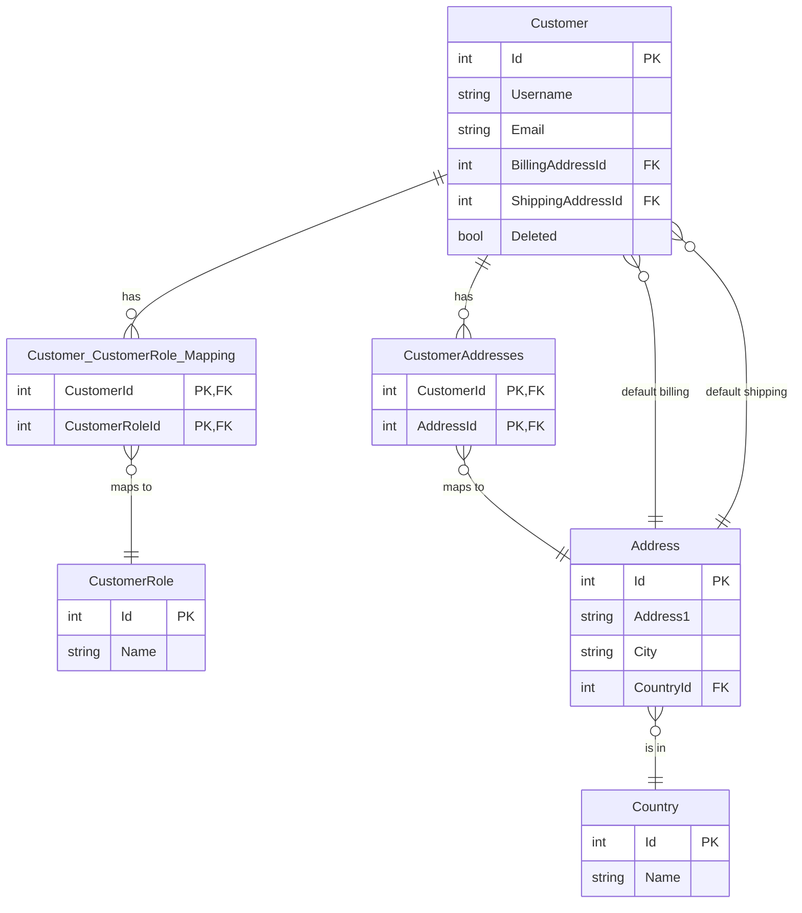
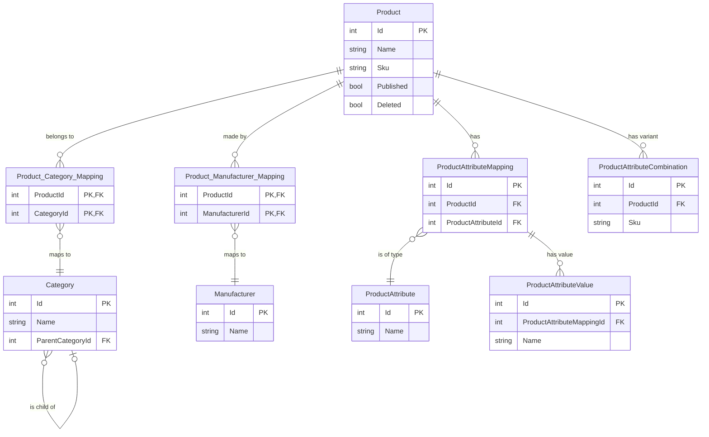
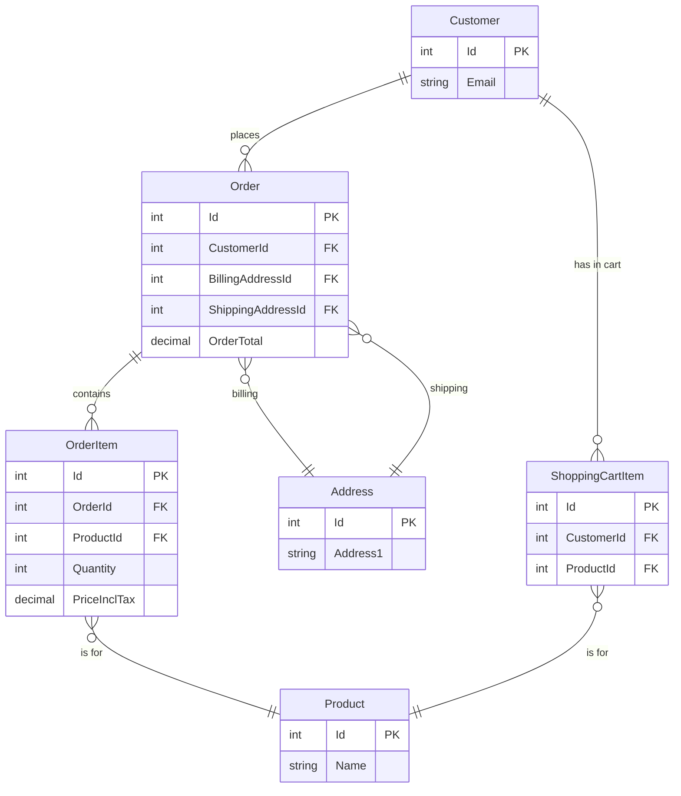

# nopCommerce Database Analysis Report
 
## 1. Summary
 
This report provides a detailed analysis of the nopCommerce database architecture. The platform utilizes a flexible and extensible data access layer built on modern .NET technologies.
 
The key architectural characteristics are:
*   **ORM:** **Linq2DB** is used as the Object-Relational Mapper, providing a lightweight and high-performance bridge between C# objects and the database.
*   **Migrations:** **FluentMigrator** is employed for database schema migrations. This allows for database schema changes to be defined and versioned in C# code, ensuring consistent deployments.
*   **Multi-Database Support:** The architecture is designed to support multiple database engines, with specific implementations for **Microsoft SQL Server**, **MySQL**, and **PostgreSQL**.
*   **Data Access Pattern:** A generic **Repository Pattern** (`IRepository<TEntity>`) is used to abstract data access, providing a consistent interface for CRUD operations and querying.
*   **Caching:** A multi-level caching strategy is implemented at the repository level, utilizing both short-term and static cache managers to reduce database load.
*   **Backward Compatibility:** A sophisticated **Name Compatibility Manager** ensures that the application can work with legacy database schemas that may use different table and column naming conventions.
*   **Dependency Management:** Table creation is explicitly ordered in migration files, clearly defining the dependency hierarchy and ensuring relational integrity during installation.
 
Overall, the database architecture is robust, performance-oriented, and designed for extensibility, though it relies heavily on application-level logic for enforcing certain relationships and business rules rather than database-level constraints like triggers or stored procedures.
 
---
 
## 2. Supported Database Types
 
Based on the data provider implementations in `src/Libraries/Nop.Data/DataProviders/`, nopCommerce supports the following database engines:
 
| Database Engine | Provider | Key Implementation Details | Limitations |
| :--- | :--- | :--- | :--- |
| **MS SQL Server** | `Microsoft.Data.SqlClient` | - Targets SQL Server 2012+<br>- Uses `MERGE` for efficient bulk updates.<br>- Supports `NOLOCK` query hints.<br>- Full support for backup, restore, and re-indexing. | Hashing input is limited to 8000 bytes. |
| **MySQL** | `MySqlConnector` | - Hashes FK/Index names to avoid 64-char limit.<br>- Uses `OPTIMIZE TABLE` for re-indexing.<br>- Custom logic for retrieving identity values. | **No native support for Backup/Restore/Shrink** operations through the data provider. |
| **PostgreSQL** | `Npgsql` | - Requires `citext` and `pgcrypto` extensions.<br>- Uses `REINDEX` and `VACUUM FULL` for maintenance.<br>- Custom logic for handling sequences and identity columns. | **No native support for Backup/Restore** operations through the data provider. |
 
---
 
## 3. Database Schemas Present
 
*   **Default Schema:** nopCommerce operates within the default schema of the configured database user (e.g., `dbo` for SQL Server).
*   **Custom Schema Support:** There is no built-in mechanism for specifying or using custom schemas within the core framework. All tables are created in the default schema.
*   **Multi-Tenancy:** The architecture does not support multi-tenant schemas out of the box. Multi-tenancy is handled at the application level via the `StoreId` column present in most major tables, which scopes data to a specific store.
 
---
 
## 4. Detailed Data Dictionary
 
This section provides a detailed breakdown of the most critical tables in the nopCommerce database.
 
### `Product`
Stores the core information for all products in the catalog.
 
| Column Name | Data Type | Nullable | Description |
| :--- | :--- | :--- | :--- |
| `Id` | int | No | Primary Key |
| `Name` | nvarchar(400) | No | The name of the product. |
| `Sku` | nvarchar(400) | Yes | Stock Keeping Unit, a unique identifier for the product. |
| `Price` | decimal(18,4) | No | The current price of the product. |
| `Published` | bit | No | A flag indicating if the product is visible in the public store. |
| `Deleted` | bit | No | A flag for soft-deleting the product. |
| `StockQuantity` | int | No | The current inventory level for the product. |
| `ProductTypeId` | int | No | Foreign key to the `ProductType` enum (Simple, Grouped). |
| `ParentGroupedProductId` | int | No | If this is an associated product, this is the ID of the parent grouped product. |
| `CreatedOnUtc` | datetime | No | Timestamp of when the product was created. |
| `UpdatedOnUtc` | datetime | No | Timestamp of the last update. |
 
### `Customer`
Stores information for all registered and guest users.
 
| Column Name | Data Type | Nullable | Description |
| :--- | :--- | :--- | :--- |
| `Id` | int | No | Primary Key |
| `CustomerGuid` | uniqueidentifier | No | A unique GUID for the customer. |
| `Email` | nvarchar(1000) | Yes | The customer's email address. |
| `Username` | nvarchar(1000) | Yes | The customer's username for login. |
| `Active` | bit | No | A flag indicating if the customer account is active. |
| `Deleted` | bit | No | A flag for soft-deleting the customer. |
| `IsSystemAccount` | bit | No | A flag indicating if this is a system account (e.g., for background tasks). |
| `BillingAddressId` | int | Yes | Foreign key to the `Address` table for the default billing address. |
| `ShippingAddressId` | int | Yes | Foreign key to the `Address` table for the default shipping address. |
| `CreatedOnUtc` | datetime | No | Timestamp of when the account was created. |
 
### `Order`
The central table for storing completed customer orders.
 
| Column Name | Data Type | Nullable | Description |
| :--- | :--- | :--- | :--- |
| `Id` | int | No | Primary Key |
| `OrderGuid` | uniqueidentifier | No | A unique GUID for the order. |
| `CustomerId` | int | No | Foreign key to the `Customer` who placed the order. |
| `BillingAddressId` | int | No | Foreign key to the `Address` for billing. |
| `ShippingAddressId` | int | Yes | Foreign key to the `Address` for shipping. |
| `OrderTotal` | decimal(18,4) | No | The final total amount of the order. |
| `OrderStatusId` | int | No | Foreign key to the `OrderStatus` enum (e.g., Pending, Processing, Complete). |
| `PaymentStatusId` | int | No | Foreign key to the `PaymentStatus` enum (e.g., Pending, Paid, Refunded). |
| `ShippingStatusId` | int | No | Foreign key to the `ShippingStatus` enum (e.g., Not Yet Shipped, Shipped). |
| `Deleted` | bit | No | A flag for soft-deleting the order. |
| `CreatedOnUtc` | datetime | No | Timestamp of when the order was placed. |
 
---
 
## 5. Enhanced Entity Relationship Diagrams
 
The following diagrams provide a more detailed view of the core relationships.
 
### Customer Domain ER Diagram
 

 
### Product & Catalog Domain ER Diagram
 

 
### Order Domain ER Diagram
 

 
---
 
## 6. Common Query Patterns (C# LINQ Examples)
 
This section provides practical examples of how to query the database using the repository pattern.
 
### Get Published Products in a Category
 
```csharp
// Assuming 'productRepository' and 'productCategoryRepository' are injected
var categoryId = 5;
var products = await _productRepository.GetAllPagedAsync(query =>
{
    // Join with the mapping table
    var productCategoryQuery = from p in query
                               join pc in _productCategoryRepository.Table on p.Id equals pc.ProductId
                               where pc.CategoryId == categoryId && p.Published && !p.Deleted
                               orderby pc.DisplayOrder, p.Id
                               select p;
 
    return productCategoryQuery;
});
```
 
### Get a Customer's Recent Orders
 
```csharp
// Assuming 'orderRepository' is injected
var customerId = 10;
var recentOrders = await _orderRepository.GetAllAsync(query =>
{
    return query.Where(o => o.CustomerId == customerId && !o.Deleted)
                .OrderByDescending(o => o.CreatedOnUtc)
                .Take(10);
});
```
 
### Check if a Customer is an Administrator
 
```csharp
// Assuming 'customer' object is loaded
var isAdministrator = customer.CustomerRoles
    .Any(cr => !cr.Deleted && cr.Active && cr.SystemName == "Administrators");
```
 
---
 
## 7. Extensibility Guide
 
Extending the nopCommerce database is a common requirement. Follow these best practices.
 
### Adding a New Table
 
1.  **Create Domain Entity:** Create your new entity class inheriting from `BaseEntity` in the `Nop.Core` project.
2.  **Create Mapping Builder:** In the `Nop.Data` project, create a builder class inheriting from `NopEntityBuilder<YourEntity>`. Define your columns and foreign keys in the `MapEntity` method.
3.  **Create Migration:** Create a new migration class inheriting from `NopMigration`. In the `Up()` method, use `Create.TableFor<YourEntity>()` to create the table. Add your migration to `SchemaMigration.cs` in the correct dependency order.
4.  **Create Repository:** While not strictly required, it's good practice to create a service interface and implementation that uses `IRepository<YourEntity>` for data access.
 
### Adding a Column to an Existing Table
 
1.  **Add Property:** Add the new property to the domain entity class (e.g., add `public string MyCustomField { get; set; }` to `Product.cs`).
2.  **Create Migration:** Create a new `UpdateMigration` class. In the `Up()` method, use the `Alter.Table()` fluent interface to add the new column.
    ```csharp
    // Example Migration
    [NopMigration("2025/09/11 12:00:00", "Add MyCustomField to Product", UpdateMigrationType.Data)]
    public class AddMyCustomFieldMigration : UpdateMigration
    {
        public override void Up()
        {
            Alter.Table(nameof(Product))
                .AddColumn("MyCustomField").AsString(500).Nullable();
        }
    }
    ```
 
---
 
## 8. In-Depth Index Analysis
 
The `Indexes.cs` file reveals a deliberate and performance-oriented indexing strategy.
 
*   **`IX_Product_VisibleIndividually_Published_Deleted_Extended`**: This is a key "covering index" for catalog pages. It allows the application to fetch a list of visible products without ever touching the main product table data (the clustered index). The `INCLUDE` clause contains all the necessary fields (`Id`, `AvailableStartDateTimeUtc`, etc.) to display a product on a category page, making these queries extremely fast.
*   **`IX_UrlRecord_Custom_1`**: This index is critical for the SEO slug resolution. When a request comes in, nopCommerce looks up the slug in the `UrlRecord` table. This index quickly finds the active slug for a specific entity, entity type, and language, which is the most common lookup scenario.
*   **`IX_GenericAttribute_EntityId_and_KeyGroup`**: The `GenericAttribute` table can grow very large. This index is essential for quickly retrieving all attributes for a specific entity (e.g., all generic attributes for Customer with `Id = 123`).
 
---
 
## 9. Dependency Diagram
 
The table creation order from `SchemaMigration.cs` provides a clear dependency hierarchy.
 
*   **Level 0 (Independent Tables):** These tables have no foreign key dependencies and are created first.
    *   `AddressAttribute`, `GenericAttribute`, `Country`, `Currency`, `Language`, `CustomerAttribute`, `ProductAttribute`, `ProductTag`, `ReviewType`, `SpecificationAttributeGroup`, `Setting`, `Log`, etc.
 
*   **Level 1 (Depend on Level 0):** These tables depend on the independent tables.
    *   `Address` (depends on `Country`, `StateProvince`)
    *   `Customer` (depends on `Address`, `Language`, `Currency`)
    *   `Product` (depends on `ProductTemplate`, `Vendor`)
    *   `Category` (depends on `CategoryTemplate`)
    *   `SpecificationAttribute` (depends on `SpecificationAttributeGroup`)
 
*   **Level 2 (Depend on Level 1):** These tables form the core relationships.
    *   `Order` (depends on `Customer`, `Address`)
    *   `Product_Category_Mapping` (depends on `Product`, `Category`)
    *   `Product_Manufacturer_Mapping` (depends on `Product`, `Manufacturer`)
    *   `AclRecord` (depends on `CustomerRole`)
    *   `StoreMapping` (depends on `Store`)
 
*   **Level 3+ (Complex Dependencies):**
    *   `OrderItem` (depends on `Order`, `Product`)
    *   `Shipment` (depends on `Order`)
    *   `DiscountUsageHistory` (depends on `Discount`, `Order`)
 
This explicit ordering prevents foreign key constraint errors during database installation.
 
---
 
## 10. Naming Conventions & Compatibility
 
*   **C# Naming:** Entity and property names in C# follow the standard .NET `PascalCase` convention.
*   **Database Naming:**
    *   Modern tables generally match the C# entity name (e.g., `Product`, `Customer`).
    *   Legacy mapping tables often use underscores (e.g., `Product_Category_Mapping`).
*   **Name Compatibility Manager:** The `NameCompatibilityManager` class is a critical component that resolves the correct table and column names at runtime. It loads mappings from classes implementing `INameCompatibility`, allowing the C# code to use modern names while the database can retain legacy names for backward compatibility.
*   **Foreign Key Naming:** Foreign keys are typically named using the pattern `FK_{DependentTable}_{DependentColumn}_{PrimaryTable}_{PrimaryColumn}`. For MySQL, these names are hashed to stay within character limits.
*   **Index Naming:** Indexes are descriptively named, often indicating the table and columns involved (e.g., `IX_Product_Published`, `IX_UrlRecord_Slug`).
 
---
 
## 11. Recommendations
 
*   **For Database Administrators:**
    *   Pay close attention to the custom indexes defined in `Indexes.cs`. These are critical for performance. When troubleshooting slow queries, verify that the appropriate indexes are being used.
    *   Monitor database growth, particularly for the `Log`, `ActivityLog`, and `QueuedEmail` tables, and implement a cleanup strategy if necessary.
    *   Since the application does not use stored procedures, database-level performance tuning should focus on index optimization and server configuration.
 
*   **For Application Developers:**
    *   Always use the `IRepository<TEntity>` for data access. Do not bypass it to query the database directly, as this would circumvent the caching and event publishing logic.
    *   Leverage the `IQueryable<TEntity>` `Table` property for building complex, filtered queries.
    *   Be mindful of the caching layer. When performing operations that require immediate data reflection, consider how the cache might be affected.
    *   When extending entities, use the `GenericAttribute` table for simple key-value data or create new tables and entities for more complex data structures, following the existing patterns.
 
*   **For Integration Developers:**
    *   The database is the single source of truth. When integrating with external systems, query the database tables directly (read-only) or use the nopCommerce Web API.
    *   Understand the `ISoftDeletedEntity` pattern. Always filter by `Deleted = 0` when querying for active records.
    *   The `Order` and `OrderItem` tables provide a complete, historical snapshot of financial data, which is reliable for reporting and analytics.
 
 
