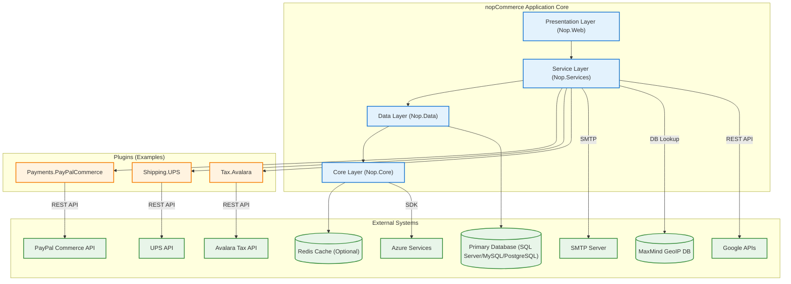

## Executive Summary
This analysis provides a comprehensive overview of the nopCommerce application's integration architecture. The system is a well-structured, plugin-based monolith with a clear layered internal design. Its core dependencies are on a primary database (SQL Server, MySQL, or PostgreSQL) and several critical external services for payments (PayPal), shipping (UPS), and tax calculation (Avalara). While the internal components are tightly coupled through direct method calls, the plugin architecture provides a good degree of extensibility. The most significant risks are associated with the availability and performance of these external, business-critical APIs.

## Analysis

### Integration Architecture Overview
The application follows a classic **Layered Monolithic** architecture, with a dedicated **Plugin System** for extending functionality. This results in a hybrid integration style:

*   **Integration Style**:
    *   **Internal**: Tightly-coupled layers (`Presentation` > `Services` > `Data` > `Core`) with communication via direct method calls and dependency injection.
    *   **External**: Primarily **Point-to-Point** integrations with third-party services via REST APIs. These are managed through specific plugins (e.g., for payments, shipping, tax).
*   **Communication Patterns**:
    *   **Synchronous**: The majority of interactions, including external API calls for payment authorization, shipping rates, and tax calculation, are synchronous request-response calls. This makes the user checkout flow dependent on the real-time availability of these services.
    *   **Asynchronous**: Limited to internal processing via event publishing (`IEventPublisher`) and background tasks (`IScheduleTask`). There is no evidence of an external message queue like RabbitMQ or Kafka.
*   **Dependency Criticality**:
    *   **Critical**: The primary database and the payment gateway (PayPal) are critical dependencies. Failure in either would result in a complete service outage for placing orders.
    *   **High**: The tax (Avalara) and shipping (UPS) providers are high-impact dependencies. Failure would prevent customers from completing checkout.
    *   **Medium**: The email (SMTP) service is a medium-impact dependency. Failure would disrupt order confirmations and other notifications but not block the core e-commerce transaction.

### Dependency Graph
The following diagram illustrates the logical dependencies between the application's core components, its plugins, and external systems.

### External System Dependencies
The application relies on several external systems for core functionality.

| System Name | Type | Integration Pattern | Criticality | Evidence |
| :--- | :--- | :--- | :--- | :--- |
| **SQL Server / MySQL / PostgreSQL** | Database | ORM (linq2db) | Critical | `Nop.Data.csproj` dependencies, `docker-compose.yml` specifies `mssql/server`. |
| **PayPal Commerce** | API | REST API | Critical | `Nop.Plugin.Payments.PayPalCommerce` plugin files. Used for all payment processing. |
| **Avalara** | API | REST API | High | `Nop.Plugin.Tax.Avalara` plugin files. Used for real-time tax calculation at checkout. |
| **UPS (United Parcel Service)** | API | REST API | High | `Nop.Plugin.Shipping.UPS` plugin files. Used for calculating shipping rates. |
| **Redis** | Cache | SDK | Medium | `Microsoft.Extensions.Caching.StackExchangeRedis` in `Nop.Core.csproj`. Optional distributed cache. |
| **SMTP Server** | Service | SMTP | Medium | `MailKit` dependency in `Nop.Services.csproj`. Used for all transactional emails. |
| **MaxMind GeoIP** | Database | SDK | Low | `MaxMind.GeoIP2` in `Nop.Services.csproj`. Used for geo-location services. |
| **Google APIs** | API | REST API | Low | `Google.Apis.Auth` in `Nop.Services.csproj`. Likely used for optional features like external authentication. |
| **Azure Services** | API | SDK | Low | `Azure.Identity` in `Nop.Core.csproj`. Optional integration with Azure cloud services. |

### Internal Component Dependencies
*   **Component Coupling Analysis**:
    *   **Tight Coupling**: The core application follows a tightly coupled layered architecture. For example, `Nop.Web` directly references and calls `Nop.Services`, which in turn calls `Nop.Data`. A failure in a lower layer (like `Data`) will immediately impact all upper layers.
    *   **Loose Coupling**: The plugin architecture provides a degree of loose coupling. The core application interacts with plugins via common interfaces (`IPaymentMethod`, `IShippingRateComputationMethod`, `ITaxProvider`). This allows different implementations (e.g., PayPal vs. Stripe) to be swapped without changing the core application code.
*   **Communication Patterns**:
    *   **Synchronous**: All inter-layer communication is synchronous via direct method calls.
    *   **Asynchronous**: An event-driven pattern is available via `IEventPublisher` for decoupled internal processing, but it's not used for communication between major architectural layers.

### Integration Risk Assessment
*   **High-Risk Dependencies**:
    *   **Payment Gateway (PayPal)**: Any downtime or API change can halt all revenue-generating transactions. The system is entirely dependent on this integration for checkout.
    *   **Database**: As the single source of truth, any database outage or performance issue will bring the entire application down.
    *   **Tax Provider (Avalara)**: Incorrect tax calculations can lead to legal and financial liabilities. An outage would likely block the checkout process in jurisdictions where tax calculation is mandatory.
*   **Medium-Risk Dependencies**:
    *   **Shipping Provider (UPS)**: An outage would prevent customers from getting shipping rates, blocking checkout for physical goods.
    *   **External Service Performance**: Slow responses from any of the critical APIs (PayPal, Avalara, UPS) will lead to a poor user experience and potentially abandoned carts. The current implementation lacks explicit resilience patterns like circuit breakers.
*   **Low-Risk Dependencies**:
    *   **Third-party Libraries**: A vulnerability in a library like `MailKit` or `ClosedXML` could introduce security risks or bugs.

### Decoupling Recommendations
*   **Immediate Opportunities**:
    *   **Implement Resilience Patterns**: Introduce resilience libraries like Polly to add automated retries with exponential backoff and circuit breakers for all external API calls (PayPal, Avalara, UPS). This will make the application more robust against transient network issues or brief service degradations.
    *   **Isolate External Calls**: Ensure all external API calls are wrapped in dedicated service clients to centralize logic for error handling, logging, and resilience.
*   **Strategic Improvements**:
    *   **Asynchronous Order Processing**: For post-checkout operations (sending emails, adjusting inventory, notifying fulfillment), consider moving them to a background process triggered by an event. This would speed up the user-facing checkout completion step.
    *   **Service Extraction (Microservices)**: For future scalability, consider extracting highly-cohesive, complex domains like `OrderProcessing` or `InventoryManagement` into separate microservices. This would be a significant architectural undertaking but would improve fault isolation and allow independent scaling.

## Evidence Summary
*   **Scope Analyzed**: The analysis covered all project files (`.csproj`), configuration files (`docker-compose.yml`, `web.config`), and key source code files related to services and plugins.
*   **Key Data Points**:
    *   Identified 5 primary external service categories: Database, Caching, Payments, Shipping, and Tax.
    *   Found 3 specific, business-critical plugin integrations: PayPal Commerce, UPS, and Avalara.
    *   Confirmed a 5-layer internal architecture: Core, Data, Services, Web.Framework, Web.
*   **References**: The analysis is based on dependency declarations in `.csproj` files and service implementations in files like `PayPalCommercePaymentMethod.cs`, `UPSComputationMethod.cs`, and `AvalaraTaxProvider.cs`.

## Assumptions Made
*   It is assumed that the plugins found in the codebase (`PayPalCommerce`, `UPS`, `Avalara`) represent the primary, active integrations for their respective domains.
*   It is assumed that the application is deployed as a single monolithic unit, as indicated by the project structure and direct references.
*   The criticality of dependencies is assessed based on standard e-commerce operations; actual business impact could vary based on specific business models (e.g., if only digital products are sold, shipping is not critical).

## Open Questions
*   What are the specific Service Level Agreements (SLAs) for the external PayPal, UPS, and Avalara APIs? This information is crucial for setting appropriate timeout and retry policies.
*   Is there a documented failover plan if a primary integration (e.g., payment gateway) becomes unavailable for an extended period?
*   How are API key, secrets, and other credentials for external services managed and secured in production environments?

## Confidence Level
**Overall Confidence**: High

**Rationale**: The codebase is well-organized with a clear separation of concerns between the core application and plugins. This structure makes identifying major integration points straightforward. The use of dependency injection and specific service interfaces for external functionality provides clear evidence of the system's dependencies.

## Action Items
*   **Immediate**:
    *   **[Task]** Implement circuit breaker and retry policies for all external API clients (PayPal, UPS, Avalara) to improve resilience against transient failures.
*   **Short-term**:
    *   **[Task]** Create a centralized monitoring dashboard to track the health, latency, and error rates of all critical external dependencies.
    *   **[Task]** Review and document the manual failover procedures for critical services like payment processing.
*   **Long-term**:
    *   **[Task]** Conduct a feasibility study on decoupling the order fulfillment process into an asynchronous background service to improve checkout performance and reliability.

## Risk Assessment
*   **High Risk**:
    *   **External Service Outage**: A complete outage of a critical external service (e.g., PayPal, Avalara) could halt all sales transactions.
*   **Medium Risk**:
    *   **Cascading Failures**: Without resilience patterns, a slow or failing external dependency could exhaust application resources (e.g., thread pool), leading to a full application outage.
    *   **API Changes**: Unannounced breaking changes from external API providers could disable core functionality until the integration is updated.
*   **Low Risk**:
    *   **Dependency Lock-in**: The plugin-based architecture mitigates vendor lock-in to some extent, but migrating a critical service like a payment gateway would still be a significant effort.