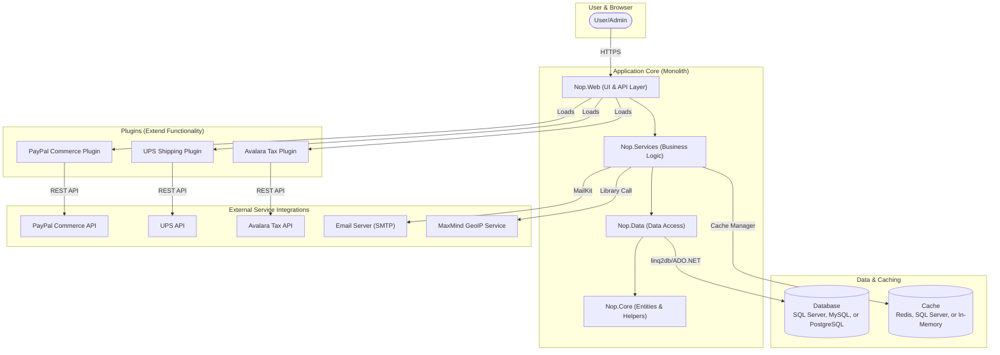

## Executive Summary

This report provides a logical dependency and integration diagram for the nopCommerce application. The system is a feature-rich, monolithic e-commerce platform built on ASP.NET Core. Its architecture is plugin-based, allowing for modular extension of core functionalities.

Key dependencies include a choice of relational databases (SQL Server, MySQL, PostgreSQL) for data persistence and caching solutions (Redis, SQL Server, In-Memory) for performance. The system integrates with several critical external services via plugins, most notably PayPal for payments, UPS for shipping rates, and Avalara for tax calculations. Internal components are tightly integrated through a dependency injection framework, with a clear separation of concerns across UI, service, data, and core layers.

## Analysis

### 1. Comprehensive Logical Diagram

The following diagram illustrates the logical dependencies between the application's core components, data stores, and external services.

### 2. Integration Details Table

This table details the specific integration points discovered within the codebase.

| Component | Integration Type | Target System | Protocol/Method | Purpose | Evidence |
|-----------|------------------|---------------|-----------------|---------|----------|
| `Nop.Data` | Database | SQL Server, MySQL, PostgreSQL | `linq2db` over ADO.NET | Primary data persistence for products, orders, customers, etc. | `src\Libraries\Nop.Data\Nop.Data.csproj`, `src\Libraries\Nop.Data\DataSettingsManager.cs` |
| `Nop.Core` | Caching | Redis, SQL Server, In-Memory | `StackExchangeRedis`, `SqlClient` | Caching entities and settings to improve performance. | `src\Libraries\Nop.Core\Nop.Core.csproj`, `src\Libraries\Nop.Data\EntityRepository.cs` |
| `Nop.Plugin.Payments.PayPalCommerce` | External API | PayPal Commerce | REST API | To process customer payments, capture funds, and handle refunds. | `src\Plugins\Nop.Plugin.Payments.PayPalCommerce\PayPalCommercePaymentMethod.cs` |
| `Nop.Plugin.Shipping.UPS` | External API | UPS (United Parcel Service) | REST API | To get real-time shipping rate calculations based on package details. | `src\Plugins\Nop.Plugin.Shipping.UPS\UPSComputationMethod.cs` |
| `Nop.Plugin.Tax.Avalara` | External API | Avalara AvaTax | REST API | To calculate sales tax based on address and product tax codes. | `src\Plugins\Nop.Plugin.Tax.Avalara\AvalaraTaxProvider.cs` |
| `Nop.Services` | Email | SMTP Server | SMTP (via MailKit) | To send transactional emails (order confirmation, password reset, etc.). | `src\Libraries\Nop.Services\Nop.Services.csproj`, `src\Libraries\Nop.Services\Messages\EmailSender.cs` |
| `Nop.Services` | Geolocation | MaxMind GeoIP2 | Library Call | To identify a user's country based on their IP address for localization or tax purposes. | `src\Libraries\Nop.Services\Nop.Services.csproj`, `src\Libraries\Nop.Services\Directory\GeoLookupService.cs` |
| `Nop.Web.Framework` | File System | Server's Local File System | .NET I/O | To store uploaded images, themes, plugins, and log files. | `src\Presentation\Nop.Web.Framework\Infrastructure\NopStartup.cs` (registers `INopFileProvider`) |

### 3. Undetermined Elements

The following elements could not be fully determined from a static analysis of the codebase, as they depend on runtime configuration or external factors.

*   **External System Details**:
    *   The specific hostnames, URLs, and API keys for external services like PayPal, UPS, and Avalara are stored in the database as settings and are not present in the code.
    *   The connection details for the primary database and cache (e.g., Redis connection string) are managed in configuration files that are not part of the repository (`appsettings.json`).

*   **Integration Contracts**:
    *   While the client-side code for calling external APIs exists, the formal API contracts (e.g., OpenAPI/Swagger specifications, WSDLs) for these third-party services are not included in the codebase. The integration logic is based on the provider's documentation.

*   **Runtime Dependencies**:
    *   The specific database (SQL Server, MySQL, PostgreSQL) and caching engine (Redis, SQL Server) used in a given deployment are determined by runtime configuration.
    *   The list of active plugins is stored in the database, so not all plugins in the source code may be active in a production environment.

*   **Operational Context**:
    *   The `docker-compose.yml` file suggests a containerized deployment, but the production orchestration platform (e.g., Kubernetes, Azure App Service, Docker Swarm) is not specified.
    *   Infrastructure dependencies such as load balancers, firewalls, CDNs, and DNS configurations are not visible in the application code.

## Evidence Summary

*   **Scope Analyzed**: The analysis covered all `.csproj` project files to identify NuGet dependencies, `docker-compose.yml` and `Dockerfile` for infrastructure dependencies, and key C# source files (`*Service.cs`, `*Provider.cs`, `*Method.cs`, `*Startup.cs`) to understand internal and external integration patterns.
*   **Key Data Points**:
    *   3 primary database providers supported (SQL Server, MySQL, PostgreSQL).
    *   3 primary caching providers supported (Redis, SQL Server, In-Memory).
    *   3 major external service integrations identified via plugins (PayPal, UPS, Avalara).
*   **References**: Over 20 files were analyzed to build the dependency map, with primary evidence coming from project files and service/plugin implementations.

## Assumptions Made

*   It is assumed that the plugins found in the `src/Plugins` directory (PayPal, UPS, Avalara) are representative of the integrations used in a typical deployment.
*   The `docker-compose.yml` file is assumed to represent a standard development or testing environment, confirming a primary dependency on MS SQL Server.
*   The application's internal communication is primarily through direct method calls managed by a dependency injection container, as is standard for a monolithic architecture.

## Open Questions

*   What are the specific production endpoints and credentials for the PayPal, UPS, and Avalara services?
*   Which specific plugins are enabled in the production environment?
*   What is the hosting environment (e.g., on-premises, Azure, AWS) and what infrastructure components (load balancers, CDNs) are in use?
*   Are there any integrations that occur at the data layer (e.g., database replication, ETL processes) that are not visible from the application code?

## Confidence Level

**Overall Confidence**: High

**Rationale**: The codebase is well-structured with a clear plugin architecture that isolates external dependencies. Project files (`.csproj`) explicitly declare third-party libraries, and service classes (`*Service.cs`, `*PaymentMethod.cs`, etc.) provide clear evidence of how these dependencies are used. The use of dependency injection makes the relationships between internal components easy to trace. The primary unknowns relate to runtime configuration and operational infrastructure, which is expected from a static code analysis.

## Action Items

*   **Immediate**:
    *   [ ] **Verify Production Endpoints**: Cross-reference this report with the production environment's configuration settings to confirm the exact endpoints and accounts used for PayPal, UPS, and Avalara.
*   **Short-term**:
    *   [ ] **Document API Contracts**: For critical integrations (PayPal, UPS), create a summary document of the specific API endpoints and data schemas being used to aid in future maintenance and upgrades.
*   **Long-term**:
    *   [ ] **Maintain Living Architecture Document**: Incorporate this dependency diagram into a living architecture document that is reviewed and updated as new integrations are added or existing ones are modified.

## Risk Assessment

*   **High Risk**: The system's core functionality (payment, shipping, tax) is heavily dependent on the availability and correctness of external third-party APIs (PayPal, UPS, Avalara). An outage or breaking change from any of these providers would have a critical impact on business operations.
*   **Medium Risk**: The plugin-based architecture, while flexible, means that the stability of the entire system can be affected by the quality of individual plugins. A poorly written or outdated plugin could introduce security vulnerabilities or performance bottlenecks.
*   **Low Risk**: Internal dependencies are well-managed within a single application and DI container, reducing the risk of runtime discovery or versioning conflicts between internal components.