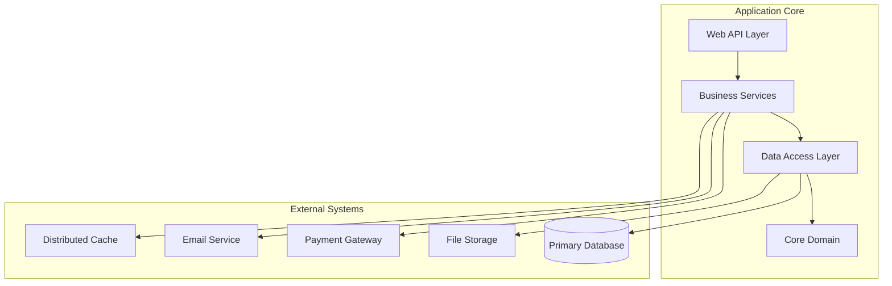
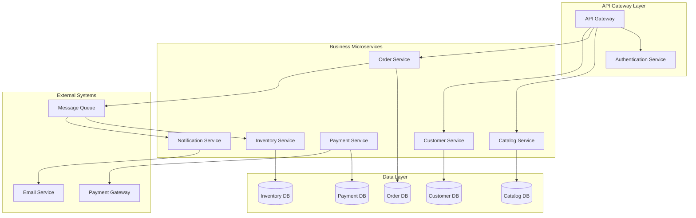
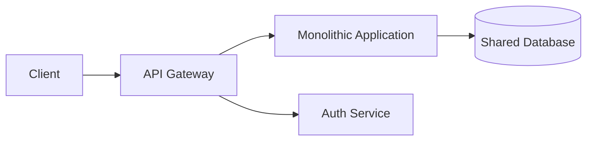
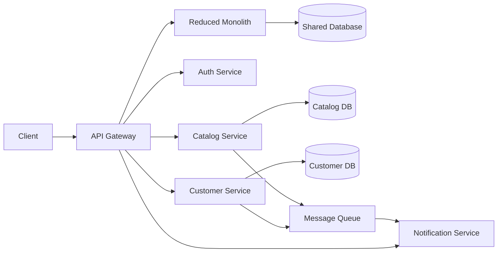
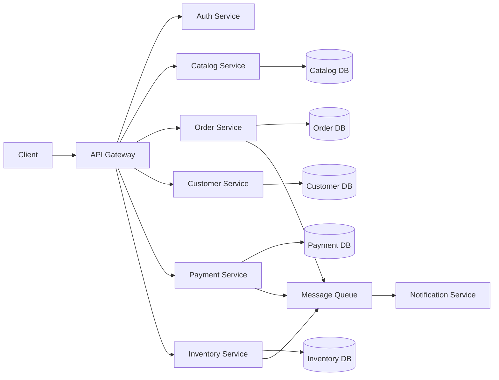
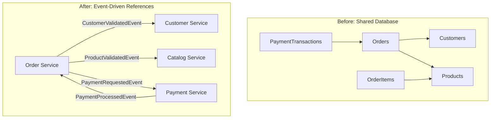
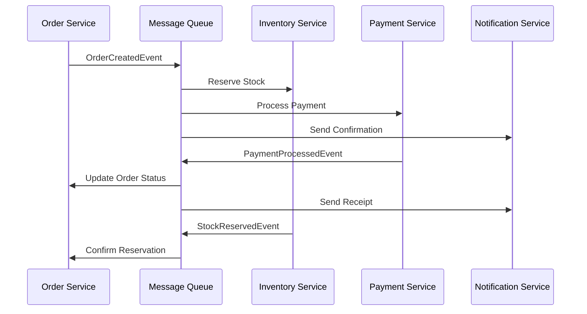
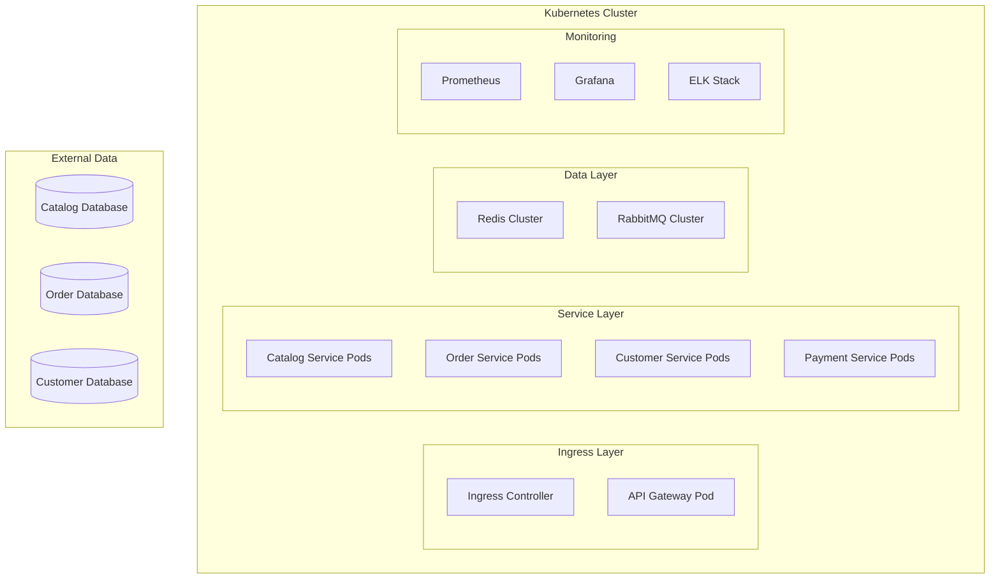

# Comprehensive Monolith to Microservices Migration Analysis

You are a **Senior Software Architect and Migration Specialist** conducting a comprehensive analysis of this codebase to understand the complete system architecture and develop a detailed strategy for migrating from monolith to microservices architecture. This analysis combines technical architecture assessment, dependency mapping, business context understanding, and implementation analysis to deliver a complete migration roadmap.

## Your Mission

Conduct a thorough end-to-end analysis of the application and deliver a comprehensive migration strategy that answers:

- What is the current technical architecture, business purpose, and implementation approach?
- How are components currently integrated and what dependencies exist?
- What is the optimal microservices decomposition strategy based on business domains and technical boundaries?
- What is the detailed 18-month migration roadmap using the Strangler Fig pattern?

## Analysis Framework

### Phase 1: Comprehensive System Discovery

#### Technical Architecture Analysis
**Examine these architectural elements:**
- Project structure and module organization
- Framework configurations and dependencies
- Design patterns and architectural styles
- Component relationships and boundaries
- Technology stack and infrastructure configurations
- Communication patterns and data flow

**Extract architectural insights:**
- Overall architectural style (Monolithic/Modular/Hybrid)
- Component boundaries and responsibilities
- Technology stack currency and modernization needs
- Design principles application and violations
- Scalability and performance considerations
- Security implementations and patterns

#### Business Context Discovery
**Examine these business elements:**
- Main application entry points and business operations
- Entity/model classes representing business concepts
- API endpoints and their business workflows
- Service classes indicating business processes
- Domain terminology and industry context
- User roles and permission structures

**Extract business insights:**
- Core business functionality and domain
- Key business operations and workflows
- User types and interaction patterns
- Business rules and constraints
- Regulatory and compliance requirements
- Integration purposes and business value

#### Integration and Dependency Mapping
**Examine these integration elements:**
- Import/using statements and external references
- Configuration files and connection strings
- API client implementations and service calls
- Database connections and data access patterns
- Message queue configurations and event handlers
- File system interactions and external dependencies

**Extract integration insights:**
- Internal component dependencies and coupling
- External system integrations and protocols
- Communication patterns (sync/async)
- Data flow and transformation points
- Critical dependency relationships
- Integration risk assessment

#### Implementation Pattern Analysis
**Examine these implementation elements:**
- Backend service implementations and frameworks
- Data access patterns and persistence layers
- API design and integration implementations
- Cross-cutting concerns (logging, security, caching)
- Configuration and deployment patterns
- Error handling and resilience implementations

**Extract implementation insights:**
- Framework usage patterns and conventions
- Component interaction patterns
- Data flow and processing implementations
- Performance optimization strategies
- Technical debt and modernization opportunities

### Phase 2: Current State Assessment

#### System Architecture Documentation
Create comprehensive documentation of current state:

**Technology Stack Assessment:**
- Programming languages and framework versions
- Database technologies and configurations
- External service dependencies and criticality
- Infrastructure and deployment approach
- Technology currency and modernization needs

**Architectural Style Analysis:**
- Monolithic vs modular organization
- Layered architecture implementation
- Component coupling and cohesion assessment
- Design pattern consistency
- Architectural anti-patterns and technical debt

**Integration Architecture Overview:**

**Current Dependency Matrix:**
| Component | Internal Dependencies | External Dependencies | Coupling Level | Migration Complexity |
|-----------|----------------------|----------------------|----------------|---------------------|
| Web Layer | Services Layer | None | Medium | Low |
| Business Services | Data Layer, Core | Payment API, Email | High | High |
| Data Access | Core Domain | Database, Cache | High | Medium |

### Phase 3: Microservices Decomposition Strategy

#### Domain-Driven Design Analysis
**Business Domain Identification:**
- Analyze business entities and their relationships
- Identify bounded contexts from business operations
- Map aggregates and domain services
- Define ubiquitous language and domain terminology
- Assess business capability alignment

**Service Boundary Definition:**
- Extract bounded contexts from service classes
- Analyze data ownership and access patterns
- Identify transaction boundaries and consistency requirements
- Map business workflows to service interactions
- Define service responsibilities and interfaces

#### Proposed Microservices Architecture

**Service Decomposition Map:**

**Service Responsibility Matrix:**
| Service | Primary Responsibilities | Data Owned | External Dependencies | Event Publishers |
|---------|-------------------------|------------|----------------------|------------------|
| Catalog Service | Product management, search, categories | Products, Categories | None | ProductUpdated, PriceChanged |
| Order Service | Order processing, fulfillment tracking | Orders, Order Items | Payment Service | OrderCreated, OrderStatusChanged |
| Customer Service | Customer profiles, preferences, addresses | Customers, Addresses | None | CustomerRegistered, ProfileUpdated |
| Payment Service | Payment processing, refunds, billing | Transactions, Billing | Payment Gateway | PaymentProcessed, PaymentFailed |
| Inventory Service | Stock management, reservations | Inventory, Reservations | None | StockUpdated, LowStockAlert |

### Phase 4: Strangler Fig Migration Strategy

#### Migration Phases and Timeline

**Phase 1: Foundation Setup (Months 1-3)**
- Set up API Gateway and routing infrastructure
- Implement authentication and authorization services
- Establish message queue and event-driven architecture
- Create monitoring, logging, and observability platform
- Set up CI/CD pipelines for microservices

**Phase 2: Extract Non-Critical Services (Months 4-6)**
- Extract Notification Service (low coupling, async operations)
- Migrate Catalog Service (read-heavy, independent data)
- Implement event-driven communication patterns
- Establish database-per-service for extracted services
- Validate monitoring and alerting systems

**Phase 3: Extract Core Business Services (Months 7-12)**
- Extract Customer Service with data migration
- Extract Inventory Service with real-time synchronization
- Migrate Payment Service with transaction handling
- Implement distributed transaction patterns (Saga)
- Handle data consistency and eventual consistency patterns

**Phase 4: Extract Complex Transactional Services (Months 13-18)**
- Extract Order Service with complex business logic
- Implement complete event sourcing and CQRS patterns
- Migrate remaining shared data and cross-cutting concerns
- Decommission monolithic components gradually
- Complete performance optimization and scaling

#### Detailed Strangler Fig Implementation

**Current State with API Gateway:**

**Intermediate State (Phase 2-3):**

**Final State (Phase 4):**

### Phase 5: Database Decomposition Strategy

#### Current Database Analysis
**Shared Database Challenges:**
- Analyze current table relationships and foreign key constraints
- Identify data ownership patterns and access boundaries
- Map transaction scopes and ACID requirements
- Assess data consistency and integrity constraints
- Document cross-service data dependencies

#### Database Migration Approach
**Database-per-Service Migration:**

**Step 1: Data Ownership Mapping**
- Catalog Service: Products, Categories, ProductCategories, ProductAttributes
- Customer Service: Customers, Addresses, CustomerRoles, CustomerAttributes  
- Order Service: Orders, OrderItems, OrderNotes, OrderStatusHistory
- Payment Service: PaymentTransactions, Refunds, BillingAddresses
- Inventory Service: StockQuantity, InventoryTracking, Reservations

**Step 2: Referential Integrity Handling**

**Step 3: Data Consistency Patterns**
- Implement Saga pattern for distributed transactions
- Use event sourcing for audit trails and data consistency
- Implement eventual consistency with compensation actions
- Design idempotent operations for retry scenarios

### Phase 6: Event-Driven Architecture Implementation

#### Event Design and Implementation
**Domain Events:**
- OrderCreated, OrderCanceled, OrderShipped, OrderDelivered
- CustomerRegistered, CustomerUpdated, CustomerDeleted  
- ProductCreated, ProductUpdated, PriceChanged, ProductDiscontinued
- PaymentProcessed, PaymentFailed, RefundIssued
- InventoryUpdated, StockReserved, StockReleased, LowStockAlert

**Event Handling Patterns:**

### Phase 7: Infrastructure and Deployment Architecture

#### Container and Orchestration Strategy
**Microservice Containerization:**
- Docker container specifications for each service
- Kubernetes deployment manifests with resource requirements
- Service discovery and load balancing configuration
- Health checks and readiness probes implementation
- Auto-scaling policies based on metrics

**Infrastructure Components:**

#### CI/CD Pipeline Design
**Build and Deployment Strategy:**
- Multi-service build pipelines with dependency management
- Automated testing strategies (unit, integration, contract)
- Blue-green and canary deployment patterns
- Database migration automation and rollback procedures
- Monitoring and alerting for deployment health

### Phase 8: Cross-Cutting Concerns Implementation

#### Security Architecture
**Distributed Security Strategy:**
- JWT-based authentication with token validation
- OAuth 2.0 and OpenID Connect integration
- API Gateway security policies and rate limiting
- Service-to-service authentication and authorization
- Secrets management and credential rotation

#### Monitoring and Observability
**Comprehensive Observability:**
- Distributed tracing with correlation IDs
- Centralized logging with structured formats  
- Metrics collection and alerting thresholds
- Health checks and circuit breaker monitoring
- Performance monitoring and capacity planning

#### Configuration Management
**Distributed Configuration:**
- Environment-specific configuration management
- Feature flags and dynamic configuration updates
- Secrets management with encryption at rest
- Configuration versioning and rollback capabilities
- Service discovery and registry integration

## Risk Assessment and Mitigation

### Technical Risks
**High-Risk Areas:**
- Distributed transaction failures and data consistency issues
- Service-to-service communication failures and cascading errors
- Database migration complexity and potential data loss
- Performance degradation during migration phases
- Increased operational complexity and debugging challenges

**Mitigation Strategies:**
- Implement comprehensive testing at all levels
- Use feature flags for gradual rollouts and quick rollbacks
- Establish robust monitoring and alerting systems
- Design idempotent operations and compensation patterns
- Create detailed runbooks and incident response procedures

### Business Risks
**Business Impact Areas:**
- Potential downtime during critical migration phases
- User experience degradation during transition periods
- Increased infrastructure and operational costs
- Team learning curve and productivity impact
- Vendor lock-in with new technology choices

**Mitigation Strategies:**
- Plan migrations during low-traffic periods
- Implement comprehensive load testing and performance validation
- Establish clear success metrics and rollback criteria
- Provide extensive team training and documentation
- Choose cloud-agnostic technologies where possible

## Success Metrics and KPIs

### Technical Metrics
- Service availability and uptime (target: 99.9% per service)
- Response time improvements (target: 30% reduction)
- Deployment frequency increase (target: daily deployments)
- Mean time to recovery (target: <30 minutes)
- System throughput improvements (target: 3x capacity)

### Business Metrics
- Development velocity increase (target: 50% faster feature delivery)
- Operational cost optimization (target: 25% reduction after migration)
- Security incident reduction (target: 80% fewer security issues)
- Team productivity and satisfaction improvements
- Innovation cycle time reduction

## Deliverables

### Technical Documentation
1. **Current State Architecture Assessment** - Complete technical architecture analysis
2. **Business Domain Analysis** - Comprehensive business capability mapping
3. **Microservices Design Specification** - Detailed service definitions and contracts
4. **Migration Roadmap** - 18-month phased implementation plan
5. **Database Migration Strategy** - Complete data decomposition approach
6. **Event-Driven Architecture Design** - Event schemas and handling patterns
7. **Infrastructure Architecture** - Container orchestration and deployment strategy
8. **Monitoring and Observability Plan** - Comprehensive observability implementation
9. **Risk Assessment and Mitigation Plan** - Detailed risk analysis and response strategies
10. **Success Metrics and KPI Framework** - Measurable success criteria

### Implementation Artifacts
- API Gateway configuration and routing rules
- Service interface contracts and OpenAPI specifications
- Database migration scripts and validation procedures
- Container specifications and Kubernetes manifests
- CI/CD pipeline configurations and deployment automation
- Monitoring and alerting configurations
- Documentation and runbooks for operations teams

## Evidence Standards

**Required Evidence:**
- Specific file paths and code references for all architectural claims
- Framework configurations and dependency evidence
- Database schema and entity relationship documentation
- API endpoint implementations and service contracts
- Performance metrics and benchmark data
- Security implementation patterns and configurations

**Analysis Depth Requirements:**
- Every architectural decision must be supported by code evidence
- Business domain mapping must reference actual entity classes and service implementations
- Migration recommendations must consider actual coupling and dependency patterns
- Risk assessments must be based on current implementation complexity
- Timeline estimates must account for actual codebase size and team capabilities

## Success Criteria

Your analysis succeeds when:
- **Executive Leadership** understands the business case and investment requirements
- **Development Teams** have clear implementation guidance and technical specifications  
- **Operations Teams** understand the infrastructure and monitoring requirements
- **Architecture Teams** can validate design decisions and technical approaches
- **Business Stakeholders** see clear value proposition and success metrics

The final deliverable must provide a complete, implementation-ready migration strategy that transforms the current monolithic architecture into a scalable, maintainable microservices architecture while minimizing business risk and maximizing long-term value.