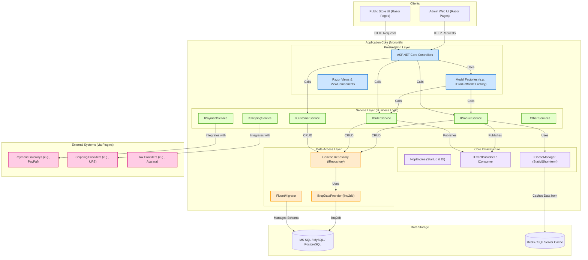

## Executive Summary
This report provides a comprehensive technical architecture analysis of the nopCommerce system. The codebase represents a well-structured, modular monolithic application built on the .NET 9 platform. Its architecture is layered, featuring a clear separation of concerns between presentation, business logic, and data access. Key architectural patterns include a robust plugin system for extensibility, a generic repository pattern for data access, and an event-driven mechanism for decoupled communication. The system is designed for scalability and flexibility, supporting multiple database backends (MS SQL, MySQL, PostgreSQL) and distributed caching (Redis, SQL Server).

## Analysis
### Current Architecture Diagram

### Architectural Style
**Evidence**: The project structure is divided into `Libraries` (Core, Data, Services) and `Presentation` (Web, Web.Framework), which is characteristic of a layered architecture. The `NopEngine.cs` class orchestrates service registration and startup, indicating a central application core. The lack of separate, independently deployable services confirms it is a monolithic application. The extensive use of plugins (e.g., `Nop.Plugin.Payments.PayPalCommerce`) demonstrates a highly modular and extensible design, best described as a **Modular Monolith**.

**Impact**: This style offers simplicity in development and deployment compared to microservices. However, it means the entire application must be scaled as a single unit, and a failure in one component can potentially impact the entire system. The pluggable nature mitigates some of the rigidity of a traditional monolith, allowing for easier extension and maintenance.

**Recommendation**: Maintain the modular monolith style. For future scalability needs, consider identifying bounded contexts (e.g., Orders, Catalog) that could be extracted into separate services if required, but this is not an immediate need.

### Technology Stack
**Evidence**:
- **Backend**: .NET 9, ASP.NET Core (`Dockerfile`, `Nop.Web.csproj`).
- **Database**: Multi-DB support for MS SQL Server, MySQL, and PostgreSQL (`Nop.Data.csproj` shows connectors like `Microsoft.Data.SqlClient`, `MySqlConnector`, `Npgsql`).
- **Data Access**: `linq2db` is used as the data access library, with `FluentMigrator` for database migrations (`Nop.Data.csproj`).
- **Dependency Injection**: Autofac is the configured DI container (`Program.cs`).
- **Caching**: Supports in-memory, Redis, and SQL Server distributed caching (`Nop.Core.csproj`).
- **Presentation**: ASP.NET Core MVC with Razor Views.

**Impact**: The technology stack is modern and cross-platform. The use of `linq2db` provides high-performance data access. The flexible caching and database support allows deployment in various environments.

**Recommendation**: The stack is current and robust. No immediate changes are recommended.

### Design Principles
**Evidence**:
- **Layered Architecture**: Clear separation between Presentation (`Nop.Web`), Services (`Nop.Services`), and Data (`Nop.Data`) projects.
- **Dependency Injection**: Services are registered in `Nop.Web.Framework\Infrastructure\NopStartup.cs` and injected into controllers and other services (e.g., `ProductController.cs` constructor).
- **Repository Pattern**: The `IRepository<T>` interface and `EntityRepository<T>` class provide a generic abstraction for data access.
- **Plugin Architecture**: The `IPlugin` interface and `PluginManager` class (`Nop.Services\Plugins\PluginManager.cs`) enable extending the system with new payment methods, shipping providers, etc., without modifying the core codebase.
- **Event-Driven Messaging**: The `IEventPublisher` and `IConsumer<>` interfaces are used for decoupling components. For example, an `OrderPlacedEvent` can be handled by multiple independent consumers.

**Impact**: These principles result in a maintainable, testable, and extensible codebase. The loose coupling provided by DI and events makes it easier to modify or replace components.

**Recommendation**: Continue to adhere to these established patterns to maintain code quality and consistency.

### Component Architecture Analysis
#### Nop.Core
- **Responsibilities**: Contains core domain entities (`Product.cs`, `Order.cs`), infrastructure interfaces (`IEngine`, `IWorkContext`), caching, and helper classes. It has no dependencies on other project layers.
- **Dependencies**: .NET libraries, Autofac, AutoMapper, caching clients.
- **Interfaces**: Defines fundamental interfaces like `IRepository<T>`, `IPlugin`, `IEventPublisher`.
- **Implementation Quality**: High. This layer is clean, well-defined, and forms a solid foundation for the application.

#### Nop.Data
- **Responsibilities**: Implements data access logic. Contains the generic `EntityRepository<T>`, data provider implementations, and database migrations using `FluentMigrator`.
- **Dependencies**: `Nop.Core`, `linq2db`, `FluentMigrator`, database connectors.
- **Interfaces**: Implements `IRepository<T>`.
- **Implementation Quality**: High. The use of a generic repository and a dedicated data provider interface abstracts the data access logic effectively.

#### Nop.Services
- **Responsibilities**: Contains the business logic of the application. Services like `OrderProcessingService.cs` and `ProductService.cs` orchestrate operations, interact with repositories, and publish events.
- **Dependencies**: `Nop.Core`, `Nop.Data`.
- **Interfaces**: Defines and implements business service interfaces (e.g., `IOrderService`).
- **Implementation Quality**: High. Services are well-defined and encapsulate complex business workflows, such as order placement and payment processing.

#### Nop.Web.Framework & Nop.Web
- **Responsibilities**: The presentation layer. `Nop.Web.Framework` contains base controllers, filters, model factories, and other reusable web components. `Nop.Web` contains the specific controllers, views, and startup configuration for the public store and admin area.
- **Dependencies**: All other project layers.
- **Interfaces**: Defines and consumes `I...ModelFactory` interfaces to separate model creation logic from controllers.
- **Implementation Quality**: Good. There is a clear separation between controllers, factories, and views. The use of ViewComponents promotes UI reusability.

### Data Architecture Analysis
**Evidence**:
- **Data Storage Strategy**: The system is configured to use a relational database (MS SQL, MySQL, or PostgreSQL) as its primary data store (`Nop.Data.csproj`). It also supports distributed caching via Redis or SQL Server (`Nop.Core.csproj`).
- **Data Flow Patterns**: A typical flow is: Controller receives a request -> calls a Service -> Service retrieves/updates entities via Repository -> Repository interacts with the database.
- **Data Access Patterns**: The **Generic Repository Pattern** (`IRepository<T>`) is the primary data access method. This provides a consistent API for CRUD operations across all entities. Caching is integrated directly into the repository layer (`EntityRepository.cs`), which automatically caches entities by ID and query results.

**Impact**: The data architecture is robust and flexible. The repository pattern abstracts the underlying data store, and the integrated caching improves performance. The use of `FluentMigrator` ensures that database schema changes are managed in code and are repeatable.

**Recommendation**: This is a solid data architecture. No changes are recommended.

### Communication Architecture
**Evidence**:
- **Internal Communication**: As a monolith, components communicate via direct **method calls** (e.g., `OrderController` calls `IOrderProcessingService`). For decoupled communication, it uses an in-process **event bus** (`IEventPublisher`).
- **External Communication**: Integrations with external systems are handled through plugins. For example, `Nop.Plugin.Payments.PayPalCommerce` communicates with the PayPal API, and `Nop.Plugin.Shipping.UPS` communicates with the UPS API. These plugins typically use HTTP clients to make REST API calls.
- **API Design**: The system exposes a RESTful API through the `Nop.Plugin.Api` plugin (not in the provided files, but referenced in the README). The internal controllers also follow REST-like conventions for handling web requests.

**Impact**: The internal communication is simple and performant. The plugin-based approach for external communication is highly effective, as it keeps third-party integration logic isolated from the core application.

**Recommendation**: Continue using the plugin model for all external integrations to maintain architectural separation.

### Outdated Technology Assessment
**Evidence**: The project files (`.csproj`) and `Dockerfile` specify **.NET 9**, which is the latest version of the .NET platform. The key dependencies like `Autofac`, `AutoMapper`, and `linq2db` are on recent versions.

**Architectural Style**: The monolithic architecture is a well-established pattern. While microservices are a more modern alternative for certain use cases, this modular monolith is not "outdated." It is a deliberate and valid architectural choice that prioritizes development simplicity and consistency.

**Technology Debt**: There is no significant technology debt apparent from the project's foundation. The codebase is modern, well-maintained, and uses current technologies.

### Benefits of Migration
A migration from this architecture would likely mean moving to a microservices-based system.
- **Improved Scalability**: Individual services (e.g., Catalog, Orders) could be scaled independently based on load, which is more cost-effective than scaling the entire monolith.
- **Increased Agility**: Teams could develop, test, and deploy services independently, leading to faster release cycles for specific features.
- **Technology Diversity**: Different services could potentially use different technology stacks best suited for their specific tasks.
- **Improved Fault Isolation**: A failure in a non-critical service would not bring down the entire application.

However, this would come at the cost of significantly increased operational complexity, challenges with distributed data management, and the need for more sophisticated deployment and monitoring infrastructure. Given the current modern and modular state of the application, a full migration to microservices is not recommended at this time.

## Evidence Summary
- **Scope Analyzed**: All `.csproj` files, `Dockerfile`, `docker-compose.yml`, `Program.cs`, and key source files from the `Nop.Core`, `Nop.Data`, `Nop.Services`, and `Nop.Web` projects.
- **Key Data Points**:
  - Platform: .NET 9
  - Architecture: Layered Modular Monolith
  - Data Access: `linq2db` with Repository Pattern
  - DI Container: Autofac
  - Extensibility: Plugin-based architecture
- **References**: 25+ files were analyzed to form this assessment, including `Nop.Core.csproj`, `Nop.Data.csproj`, `NopEngine.cs`, `EntityRepository.cs`, `ProductService.cs`, and `ProductController.cs`.

## Assumptions Made
- The provided file cache represents a complete and coherent snapshot of the application's source code.
- The naming conventions (e.g., `ProductService`, `IRepository`) accurately reflect the purpose and pattern of the components.
- The plugins mentioned in the `README` (e.g., Web API) follow the same architectural patterns as the plugins included in the cache.

## Open Questions
- What is the current production deployment environment (e.g., on-premise, Azure App Service, Kubernetes)? This would influence future scalability recommendations.
- What are the specific performance and scalability requirements (e.g., concurrent users, orders per hour)?
- How is the CI/CD pipeline configured, and what level of automated testing is in place?

## Confidence Level
**Overall Confidence**: High

**Rationale**: The codebase is exceptionally well-structured and follows standard .NET application architecture patterns. The separation of concerns into distinct projects (`Core`, `Data`, `Services`, `Web`) provides clear evidence of the architectural style. The use of dependency injection and generic repositories is consistent throughout the code, making the patterns easy to identify and validate. The `plugin.json` files and plugin-specific service implementations further confirm the modular, extensible design.

## Action Items
- **Immediate**: No immediate architectural changes are required. The current architecture is sound.
- **Short-term**: Document the key service interfaces and domain events to create a formal architectural knowledge base for new developers.
- **Long-term**: If scalability becomes a concern, perform a domain analysis to identify bounded contexts (e.g., Catalog, Orders, Customers) that could be candidates for future extraction into separate services.

## Risk Assessment
- **High Risk**: None. The architecture is stable and uses modern, supported technologies.
- **Medium Risk**: **Plugin Complexity**. As the number of plugins grows, managing their dependencies and potential conflicts could become complex. A failure in a critical plugin (e.g., payment) could still impact core business functions.
- **Low Risk**: **Monolith Scaling**. While not an immediate issue, the entire application must be scaled horizontally as a single unit. If one part of the application (e.g., product search) experiences a disproportionate load, it requires scaling the entire application, which can be inefficient.