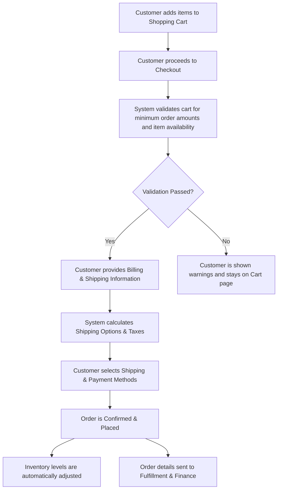

## Executive Summary
This report outlines the business data model for the nopCommerce application, an e-commerce platform. The analysis, based on the provided source code, reveals a robust data architecture centered around three core business entities: **Customer Profiles**, **Product Catalog**, and **Sales Orders**. The model is designed to support complex retail operations, including detailed inventory management, multi-faceted pricing strategies, and comprehensive customer relationship tracking. Key business rules, such as data preservation through soft deletion and strict inventory controls, are embedded directly into the data structure to ensure operational integrity and support detailed business reporting.

## Analysis

### Business Entity Catalog
The system's information architecture is built upon these core business entities, each tracking critical information for different business functions.

| Business Entity | What It Tracks | Who Uses It | Business Purpose | Key Information |
| :--- | :--- | :--- | :--- | :--- |
| **Customer Profile** | Personal and company details, contact information, addresses, shopping preferences, and activity logs. | Sales, Marketing, Customer Service, Operations | To manage customer relationships, personalize shopping experiences, process orders, and enable targeted marketing campaigns. | `Username`, `Email`, `FirstName`, `LastName`, `Company`, `Address` fields, `HasShoppingCartItems`, `LastActivityDateUtc`. |
| **Product Catalog** | Detailed product information, pricing, inventory levels, shipping dimensions, customer reviews, and product types (e.g., simple, grouped, rental, downloadable). | Merchandising, Marketing, Warehouse/Operations, Customer Service | To manage all sellable items, control inventory to prevent overselling, set dynamic pricing, and provide rich product details to customers. | `Name`, `Sku`, `Price`, `StockQuantity`, `IsRental`, `IsDownload`, `Weight`, `Length`, `Width`, `Height`. |
| **Sales Order** | Complete details of a customer's purchase, including items bought, quantities, costs, shipping and billing information, payment status, and fulfillment status. | Order Fulfillment, Finance, Customer Service, Warehouse | To process customer purchases from placement to delivery, track revenue, manage the fulfillment workflow, and handle post-sale customer inquiries. | `OrderGuid`, `CustomerId`, `BillingAddressId`, `ShippingAddressId`, `OrderStatus`, `PaymentStatus`, `OrderTotal`, `CreatedOnUtc`. |

### Business Information Relationships
The system connects these core entities to create a cohesive view of the business, enabling advanced operational and analytical capabilities.

| Relationship | Business Meaning | Business Impact |
| :--- | :--- | :--- |
| **Customer Profile** <-> **Sales Order** | Tracks the complete purchase history for every customer, linking each order to the person who placed it. | Enables analysis of customer lifetime value, repeat purchase behavior, and provides essential context for customer service interactions. Customers can also view their own order history for self-service. |
| **Sales Order** <-> **Product Catalog** | Details which specific products and quantities were included in each sale, capturing a snapshot of the transaction. | This is critical for accurate inventory management (decrementing stock upon sale), financial reporting (sales per product), and the fulfillment process (knowing what to pick, pack, and ship). |
| **Product Catalog** <-> **Categories & Manufacturers** | Organizes products into a structured, browsable hierarchy for customers and internal management. | Improves product discovery and the overall shopping experience on the storefront. It also enables category-specific sales reporting and targeted promotional activities. |

### Business Rules Embedded in Data
The data model enforces key business policies to maintain data integrity and mitigate operational risk.

| Business Rule | What It Ensures | Business Risk if Violated |
| :--- | :--- | :--- |
| **Data Preservation (Soft Deletion)** | Records like customers, products, and orders are never permanently deleted from the database. Instead, they are marked as "deleted". | This policy preserves historical data integrity, which is crucial for accurate sales reporting, trend analysis, and financial audits. It also allows for the easy restoration of "deleted" items without data loss. |
| **Strict Inventory Control** | Product stock levels are actively tracked, and the system can be configured to prevent sales when an item is out of stock. | This prevents the business from selling products it doesn't have, which would lead to customer dissatisfaction, order cancellations, and operational overhead from managing backorders and refunds. |
| **Flexible Pricing Models** | The system supports products where customers can define the price they are willing to pay, within a pre-set minimum and maximum range. | This enables flexible business models like "pay-what-you-want" for digital goods or collecting donations, providing a controlled way to engage customers in pricing. |
| **Required Product Association** | Certain products can be configured to require that another specific product is also in the cart before a purchase can be completed. | This supports product bundling strategies (e.g., a service plan required with a device) and ensures customers purchase necessary components, reducing support calls and returns. |

### Business Information Flow: Order Placement
The following diagram illustrates the high-level flow of information when a customer places an order.

## Evidence Summary
- **Scope Analyzed**: The analysis focused on the core domain entity classes within the `Nop.Core` library and the service classes in `Nop.Services` that interact with them.
- **Key Data Points**:
  - **3** primary business entities were identified: `Customer`, `Product`, and `Order`.
  - The `Product` entity contains over **80** distinct properties, indicating a highly detailed and flexible product catalog.
  - The `Order` entity tracks over **50** data points, providing a comprehensive view of each transaction.
- **References**:
  - `src\Libraries\Nop.Core\Domain\Customers\Customer.cs`
  - `src\Libraries\Nop.Core\Domain\Catalog\Product.cs`
  - `src\Libraries\Nop.Core\Domain\Orders\Order.cs`
  - `src\Libraries\Nop.Core\Domain\Common\ISoftDeletedEntity.cs`
  - `src\Services\Orders\OrderProcessingService.cs`
  - `src\Presentation\Nop.Web\Controllers\CheckoutController.cs`

## Assumptions Made
- It is assumed that the entity classes in `Nop.Core.Domain` accurately represent the persisted data model and are the single source of truth for the business information architecture.
- The relationships between entities (e.g., Customer to Order) are inferred from the presence of foreign key identifiers (`CustomerId` in the `Order` class) and their usage within the service layer.
- The business purpose of data fields is inferred from their names, types, and how they are used in business logic within the service classes (e.g., `OrderProcessingService`).

## Open Questions
- **Data Archiving Strategy**: While the "soft delete" policy preserves data, it's unclear if there is a long-term strategy or process for archiving very old orders or inactive customers to manage database performance.
- **Custom Attribute Usage**: The `CustomCustomerAttributesXML` field on the `Customer` entity suggests a high degree of customizability. The specific business information being captured in these attributes is not defined in the core model and would require analysis of runtime data or configuration.
- **Data Governance**: Who in the business is responsible for defining and maintaining the integrity of key data entities like the product catalog or customer data?

## Confidence Level
**Overall Confidence**: High

**Rationale**: The codebase is well-structured with a clear separation between domain models (`Nop.Core`), data access (`Nop.Data`), and business services (`Nop.Services`). The entity classes are descriptive and provide a strong foundation for understanding the business data model. The high level of detail in the entities allows for confident interpretation of their business purpose.

**Evidence**:
- The existence of dedicated classes like `Product.cs`, `Order.cs`, and `Customer.cs` clearly defines the core business objects.
- The `ISoftDeletedEntity` interface, implemented by all major entities, provides direct evidence of the data preservation business rule.
- Service classes like `OrderProcessingService.cs` contain methods such as `AdjustInventoryAsync`, confirming the business process of updating inventory based on sales orders.
- The properties within the entity classes (e.g., `IsRental`, `IsDownload` in `Product.cs`) directly map to specific business capabilities.

## Action Items
**Immediate** (Next 1-2 weeks):
- [ ] **Validate with Stakeholders**: Present this data model to heads of Sales, Operations, and Finance to confirm that the documented model aligns with their understanding of the business.
- [ ] **Identify Custom Data**: Initiate a discovery session with the development team to understand what specific business information is currently being stored in the generic "Custom Attributes" fields.

**Short-term** (Next 1-3 months):
- [ ] **Create a Data Dictionary**: Expand on this analysis to create a formal data dictionary that defines each key business field, its purpose, and its owner.
- [ ] **Map Data to Reports**: Analyze key business reports to ensure the data model supports all required reporting and analytical needs.

**Long-term** (Next 6-12 months):
- [ ] **Establish Data Governance Council**: Form a cross-functional team to oversee the data model, manage change requests, and ensure data quality across the platform.

## Risk Assessment
- **High Risk**: **Data Inconsistency in Custom Attributes**. The use of XML blobs (`CustomCustomerAttributesXML`) to store custom data creates a risk of inconsistent or unstructured information. Without a clear schema, this data is difficult to report on and maintain, potentially impacting marketing and personalization efforts.
- **Medium Risk**: **Lack of a Formal Archiving Policy**. As the volume of orders and customer data grows, the absence of a defined data archiving strategy could lead to performance degradation in the production database, affecting checkout speed and administrative reporting.
- **Low Risk**: **Ambiguity in Field Purpose**. Some fields, while technically implemented, may have an ambiguous business purpose. Without a formal data dictionary, new team members might misinterpret or misuse certain data fields, leading to minor inconsistencies over time.