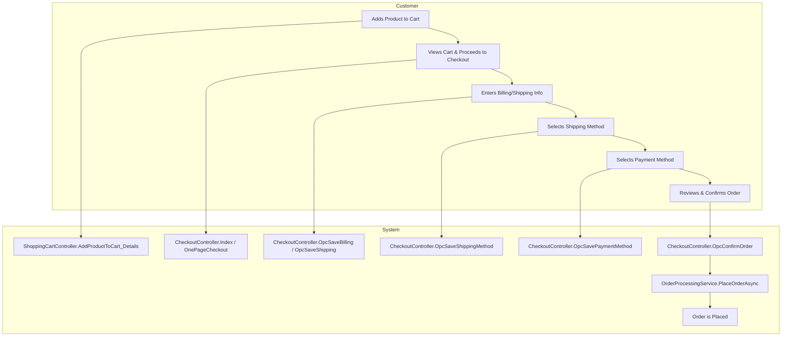
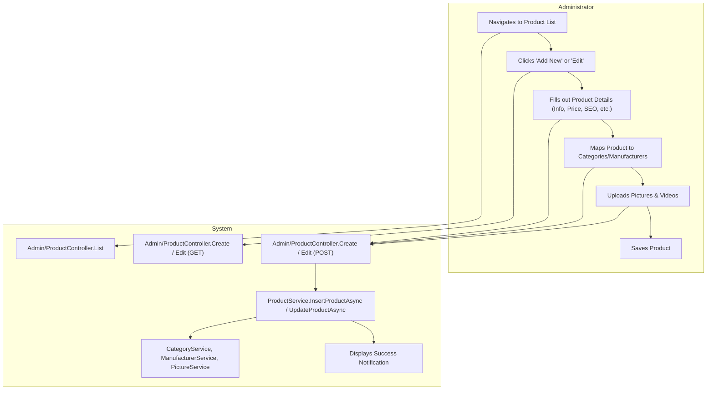

## Executive Summary
This report outlines the user personas and their primary journeys within the nopCommerce system. Based on code analysis, four key user roles have been identified: Store Administrator, Vendor, Registered Customer, and Guest Customer. Each role has distinct responsibilities and interacts with the system through specific workflows, such as product management, order fulfillment, and purchasing. The system supports a comprehensive e-commerce lifecycle, from catalog management by administrators and vendors to product discovery and checkout by customers.

## Analysis

### User Persona Table

| Attribute | Description |
| :--- | :--- |
| **Role Name** | **Store Administrator** |
| **Primary Responsibilities** | - Manages the entire product catalog, including categories and manufacturers. - Oversees all customer orders and manages the fulfillment process (shipping, delivery). - Configures all store settings, including payments, shipping, taxes, and security. - Manages customer accounts, roles, and permissions. - Reviews and approves vendor applications and product reviews. |
| **Success Metrics/KPIs** | - Overall store revenue and profitability. - Order processing time. - Customer satisfaction scores. - System uptime and performance. |
| **Pain Points** | - Complexity of managing a large number of settings across multiple areas. - Keeping track of vendor activities and product quality. - Manually handling complex order issues or customer disputes. |
| **Decision Authority** | - Full authority over all store operations, product listings, and user management. - Can approve/reject orders, refunds, and vendor applications. |
| **Business Impact if System Fails** | - Complete halt of all business operations, including sales and fulfillment. - Inability to manage the store, leading to potential revenue loss and customer dissatisfaction. |
| **Escalation Path** | - Typically the final decision-maker; may escalate to technical support or developers for system-level issues. |

| Attribute | Description |
| :--- | :--- |
| **Role Name** | **Vendor** |
| **Primary Responsibilities** | - Manages their own product catalog, including adding, editing, and deleting their products. - Monitors their own sales and orders. - May be involved in the fulfillment process for their specific products. |
| **Success Metrics/KPIs** | - Sales volume and revenue for their products. - Positive product reviews. - Efficient order fulfillment. |
| **Pain Points** | - Limited to managing only their own products, cannot see overall store performance. - Dependent on the Store Administrator for certain configurations and approvals. - Navigating the admin interface to find their specific products and orders. |
| **Decision Authority** | - Authority over their own product listings (pricing, description, images). - Limited to actions permitted by the Store Administrator (e.g., cannot import products if disabled). |
| **Business Impact if System Fails** | - Inability to manage products or view sales, leading to lost revenue opportunities and potential stock management issues. |
| **Escalation Path** | - Store Administrator. |

| Attribute | Description |
| :--- | :--- |
| **Role Name** | **Registered Customer** |
| **Primary Responsibilities** | - Browse and search for products. - Manage personal account information (addresses, password). - Place orders and track their status. - Write product reviews and participate in forums. - Maintain a shopping cart and wishlist. |
| **Success Metrics/KPIs** | - Successful and timely order completion. - Ease of finding products. - Positive shopping experience. |
| **Pain Points** | - Forgetting password and going through recovery process. - Checkout process can be lengthy if not using saved information. - Orders being cancelled due to stock issues. |
| **Decision Authority** | - Full control over their own account and purchasing decisions. |
| **Business Impact if System Fails** | - Inability to log in, view order history, or place new orders, leading to frustration and potential loss of loyalty. |
| **Escalation Path** | - Store's customer support. |

| Attribute | Description |
| :--- | :--- |
| **Role Name** | **Guest Customer** |
| **Primary Responsibilities** | - Browse and search for products. - Place orders by providing necessary information at checkout. |
| **Success Metrics/KPIs** | - Quick and easy checkout process without needing to create an account. |
| **Pain Points** | - Must re-enter personal and payment information for every purchase. - Cannot track order history or save items to a wishlist for later. |
| **Decision Authority** | - Purchasing decisions for the current session. |
| **Business Impact if System Fails** | - Inability to complete a purchase, leading to immediate lost sales. |
| **Escalation Path** | - Store's customer support. |

### User Journey Maps

#### Journey Name: Customer Purchase (One-Page Checkout)

**Participants**: Registered Customer, Guest Customer

**Value Chain**: This is the primary revenue-generating journey. A successful journey leads to a sale, customer satisfaction, and potential repeat business.

**Steps**:
1.  **Add Product to Cart**
    *   **User Goal**: Select a product for purchase.
    *   **System Support**: The `ShoppingCartController` handles adding products to the cart from catalog or product details pages. The system confirms the addition and updates the cart summary.
    *   **Decision Points**: Choose product attributes, quantity, and whether to add to cart or wishlist.
    *   **Success Criteria**: Product appears in the shopping cart with correct options and price.

2.  **Proceed to Checkout**
    *   **User Goal**: Start the payment and shipping process.
    *   **System Support**: The `CheckoutController` validates the cart and user status (guest vs. registered). It initiates the one-page checkout flow.
    *   **Decision Points**: Continue shopping or proceed to checkout.
    *   **Success Criteria**: User is taken to the checkout page.

3.  **Enter Billing & Shipping Information**
    *   **User Goal**: Provide delivery and payment details.
    *   **System Support**: The `OpcSaveBilling` and `OpcSaveShipping` actions in `CheckoutController` process and save address information. Registered users can select from saved addresses. Guests must enter new information. The system validates address fields.
    *   **Decision Points**: Use an existing address or enter a new one. Choose if shipping address is the same as billing.
    *   **Success Criteria**: Valid addresses are accepted, and the user moves to the next step.

4.  **Select Shipping & Payment Methods**
    *   **User Goal**: Choose how the order will be delivered and paid for.
    *   **System Support**: `OpcSaveShippingMethod` and `OpcSavePaymentMethod` actions save the user's choices. The system presents available options based on the shipping address and cart contents.
    *   **Decision Points**: Select a shipping speed/carrier. Select a payment method (Credit Card, PayPal, etc.).
    *   **Success Criteria**: Choices are saved, and the order total is updated accordingly.

5.  **Confirm Order**
    *   **User Goal**: Review the final order details and complete the purchase.
    *   **System Support**: The `OpcConfirmOrder` action triggers the `OrderProcessingService` to place the order, process payment, and adjust inventory.
    *   **Decision Points**: Final decision to place the order.
    *   **Success Criteria**: Order is successfully placed, and the user is redirected to the "Completed" page.

---

#### Journey Name: Administrator Product Management

**Participants**: Store Administrator

**Value Chain**: This journey directly impacts the store's revenue potential by making products available for sale. It ensures product information is accurate and appealing to customers.

**Steps**:
1.  **Navigate to Product List**
    *   **User Goal**: View all products to find one to edit or to create a new one.
    *   **System Support**: The `ProductController` (Admin area) `List` action displays a searchable and filterable grid of all products.
    *   **Decision Points**: Search for a specific product or initiate the creation of a new one.
    *   **Success Criteria**: The administrator can locate the desired product or access the "Add New" page.

2.  **Create or Edit Product Information**
    *   **User Goal**: Enter or update all product details.
    *   **System Support**: The `Create` and `Edit` actions in `Admin\ProductController` display a comprehensive form with tabs for info, pricing, shipping, inventory, pictures, attributes, and SEO.
    *   **Decision Points**: Set price, SKU, stock quantity, map to categories/manufacturers, upload images, define attributes.
    *   **Success Criteria**: All required product data is entered and validated.

3.  **Save Product**
    *   **User Goal**: Persist the new or updated product to the database.
    *   **System Support**: The `Create` or `Edit` POST actions process the model. `ProductService` handles the `InsertProductAsync` or `UpdateProductAsync` logic. The system saves the product, associated mappings (categories, manufacturers), and updates the URL record.
    *   **Decision Points**: Save and continue editing, or save and return to the product list.
    *   **Success Criteria**: The product is saved successfully, and a success notification is displayed.

### Business Flow Diagrams

#### Customer Purchase Journey

#### Administrator Product Management Journey

## Evidence Summary
- **User Roles**: Defined based on `CustomerRoles` in `Nop.Core.Domain.Customers` and permission checks in controllers (e.g., `[CheckPermission(StandardPermission.Catalog.PRODUCTS_VIEW)]` in `Admin\ProductController.cs`). The distinction between registered users and guests is managed by `ICustomerService.IsGuestAsync`. Vendor-specific logic is present in `Admin\ProductController.cs` and `Admin\OrderController.cs`.
- **Customer Journey**: The one-page checkout flow is explicitly laid out in `Views\Checkout\OnePageCheckout.cshtml`, with corresponding actions in `Controllers\CheckoutController.cs` (e.g., `OpcSaveBilling`, `OpcSaveShippingMethod`).
- **Admin Journey**: Product management functions are detailed in `Areas\Admin\Controllers\ProductController.cs`, covering creation, editing, deletion, and management of related data like pictures, attributes, and specifications.
- **System Capabilities**: The `IOrderProcessingService` and its implementation in `OrderProcessingService.cs` detail the business logic for placing orders, handling payments, and managing inventory adjustments, which are core to the user journeys.

## Assumptions Made
- It is assumed that the standard nopCommerce roles (Administrators, Vendors, Registered, Guests) are the primary user personas and that custom roles, while possible, are not central to the core business flows for this analysis.
- Success metrics and pain points are inferred from the system's capabilities and common e-commerce user expectations, as they are not explicitly defined in the code.
- The "One-Page Checkout" is assumed to be the primary customer journey as it is the default enabled option in a standard nopCommerce setup and its logic is well-defined in `CheckoutController.cs`.

## Open Questions
- Are there any custom user roles with significant responsibilities that are not part of the default nopCommerce setup?
- What are the most common pain points reported by actual users of the system?
- Which user journeys are considered most critical to the business from a strategic perspective?
- Are there any significant offline processes that complement these system-based user journeys (e.g., manual order verification)?

## Confidence Level
**Overall Confidence**: High

**Rationale**: The codebase provides a very clear and structured representation of user roles and their corresponding workflows. The use of specific controllers for public and admin areas, combined with a well-defined service layer, makes it straightforward to trace user journeys. The presence of permission checks and role-based logic confirms the responsibilities of different user personas. The one-page checkout view (`OnePageCheckout.cshtml`) serves as an excellent blueprint for the primary customer journey.

**Evidence**:
- **Role Definitions**: `Nop.Core.Domain.Customers.NopCustomerDefaults` contains system names for default roles like `AdministratorsRoleName` and `GuestsRoleName`.
- **Permissions**: `Nop.Services.Security.StandardPermission` defines the capabilities for different roles.
- **Journeys**: `Nop.Web.Controllers.CheckoutController.cs` contains the sequence of actions for the checkout process (`OpcSaveBilling`, `OpcSaveShipping`, etc.). `Nop.Web.Areas.Admin.Controllers.ProductController.cs` contains the full suite of product management actions.

## Action Items
- **Immediate**: Validate the inferred user personas and their responsibilities with business stakeholders to ensure they align with actual business roles.
- **Short-term**: Conduct usability testing on the most critical user journeys, particularly the customer checkout and administrator product management flows, to identify real-world pain points.
- **Long-term**: Develop a user journey analytics plan to track key metrics (e.g., cart abandonment rate, time to create a product) to identify areas for continuous improvement.

## Risk Assessment
- **High Risk**: The customer checkout journey is mission-critical. Any friction or failure in this flow directly impacts revenue. The complexity of the one-page checkout, with its multiple asynchronous steps, presents a risk of failure if not thoroughly tested across all scenarios.
- **Medium Risk**: The administrator product management journey. Inefficiencies or bugs in this area can slow down the process of getting new products to market or updating existing ones, indirectly affecting revenue and competitiveness.
- **Low Risk**: Secondary user journeys like writing product reviews or managing forum subscriptions. While important for engagement, failures in these areas do not typically have an immediate financial impact.