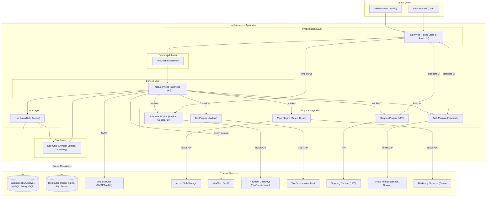

## Executive Summary
This report provides a logical dependency and integration diagram for the nopCommerce application. The analysis reveals a well-structured, layered architecture with a pluggable system for extensions. The core application is a modular monolith that integrates with various external systems for payments, shipping, taxes, and marketing. Key external dependencies include database systems (SQL Server, MySQL, PostgreSQL), cloud storage (Azure Blob), and numerous third-party APIs like PayPal, Avalara, and Facebook.

## Logical Dependencies & Integration Diagram

### System Overview
The nopCommerce system is designed with a classic N-tier architecture, separating presentation, service, and data access layers. A central `Nop.Core` library provides domain models and shared infrastructure. The system's functionality is extended via a robust plugin architecture, which is the primary mechanism for integrating with external services like payment gateways, shipping carriers, and tax providers. Data is persisted in a relational database, with support for multiple database vendors.

### Dependency Diagram

### Integration Details Table

| Component | Integration Type | Target System | Protocol/Method | Purpose | Evidence |
|---|---|---|---|---|---|
| `Nop.Data` | DB | SQL Server, MySQL, PostgreSQL | Linq2DB, SQL | Primary data persistence for all application entities. | `src/Libraries/Nop.Data/Nop.Data.csproj` |
| `Nop.Core` | Cache | Redis, SQL Server | `Microsoft.Extensions.Caching` | Distributed caching for performance enhancement. | `src/Libraries/Nop.Core/Nop.Core.csproj` |
| `Nop.Services` | Email | SMTP Servers | SMTP (via MailKit) | Sending transactional emails (order confirmation, etc.). | `src/Libraries/Nop.Services/Nop.Services.csproj` |
| `Nop.Services` | Geo-Location | MaxMind | Library API | GeoIP lookups for location-based services. | `src/Libraries/Nop.Services/Nop.Services.csproj` |
| `Nop.Plugin.Payments.AmazonPay` | API | Amazon Pay | REST API | Processing payments through Amazon Pay. | `src/Plugins/Nop.Plugin.Payments.AmazonPay/Nop.Plugin.Payments.AmazonPay.csproj` |
| `Nop.Plugin.Payments.PayPalCommerce` | API | PayPal | REST API | Processing payments and managing orders via PayPal. | `src/Plugins/Nop.Plugin.Payments.PayPalCommerce/Nop.Plugin.Payments.PayPalCommerce.csproj` |
| `Nop.Plugin.Tax.Avalara` | API | Avalara AvaTax | REST API | Real-time tax calculation. | `src/Plugins/Nop.Plugin.Tax.Avalara/Nop.Plugin.Tax.Avalara.csproj` |
| `Nop.Plugin.Shipping.UPS` | API | UPS | API (likely SOAP/XML or REST) | Fetching real-time shipping rates from UPS. | `src/Plugins/Nop.Plugin.Shipping.UPS/Nop.Plugin.Shipping.UPS.csproj` |
| `Nop.Plugin.ExternalAuth.Facebook` | Auth | Facebook | OAuth 2.0 | Allowing users to log in with their Facebook account. | `src/Plugins/Nop.Plugin.ExternalAuth.Facebook/Nop.Plugin.ExternalAuth.Facebook.csproj` |
| `Nop.Plugin.Misc.AzureBlob` | Storage | Azure Blob Storage | REST API | Storing media files (product images, etc.) in Azure. | `src/Plugins/Nop.Plugin.Misc.AzureBlob/Nop.Plugin.Misc.AzureBlob.csproj` |
| `Nop.Plugin.Misc.Brevo` | API | Brevo (formerly Sendinblue) | REST API | Marketing automation, transactional emails, and SMS. | `src/Plugins/Nop.Plugin.Misc.Brevo/Nop.Plugin.Misc.Brevo.csproj` |

### Undetermined Elements

- **External System Details**: The exact endpoint URLs, API keys, and account credentials for external services (PayPal, Avalara, UPS, Azure, etc.) are not present in the code. They are managed through the admin UI and stored in the database as settings, making them runtime configurations.
- **Integration Contracts**: While the code contains client logic and data models for interacting with external APIs, the full API specifications (e.g., OpenAPI, WSDL) for these third-party services are not part of the codebase.
- **Runtime Dependencies**: The specific database (e.g., MS SQL vs. PostgreSQL) and distributed cache (e.g., Redis vs. SQL Server) used in any given deployment are determined by runtime configuration, not hardcoded.
- **Operational Context**: The codebase does not define the underlying infrastructure. Details such as load balancers, reverse proxies, CDN configurations, or specific cloud hosting environments (beyond the use of Azure Blob Storage) are not visible from the code. The provided `Dockerfile` and `docker-compose.yml` files suggest containerization is supported but do not dictate the production orchestration strategy.