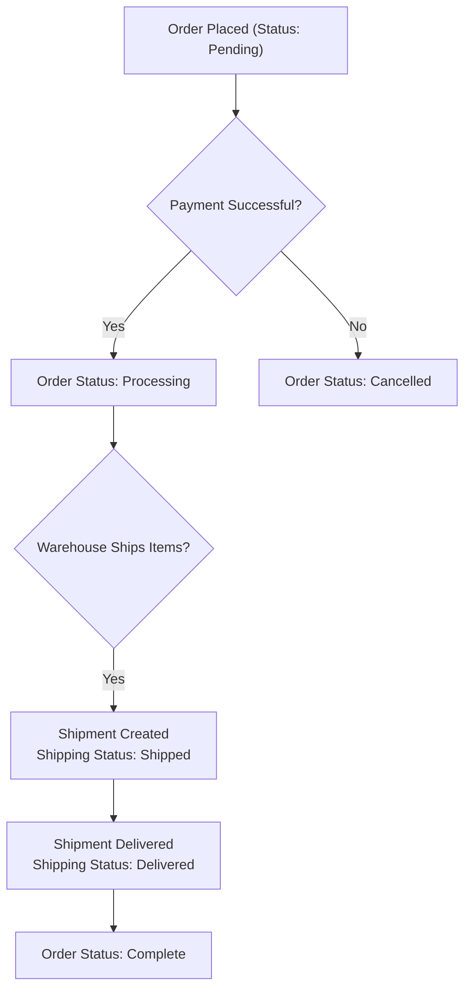

Here is the Business Data Model report for the nopCommerce application, created by a Business Data Analyst.

### Executive Summary

The nopCommerce application is built on a comprehensive and mature information architecture designed to support a full-featured e-commerce business. The system meticulously tracks all key aspects of online retail, including detailed customer profiles, a flexible product catalog, the complete order-to-fulfillment lifecycle, and various marketing and content management activities. This data model enables the business to manage sales, understand customer behavior, control inventory, and make data-driven decisions to optimize operations and revenue. The core information pillars are **Customers**, **Products**, and **Orders**, which are interconnected to provide a 360-degree view of the business.

### Analysis

#### Business Entity Documentation

The system tracks several core business entities. The most critical ones are detailed below, explaining what information they hold and why it is vital for the business.

| Business Entity | What It Tracks | Who Uses It | Business Purpose | Key Information |
| :--- | :--- | :--- | :--- | :--- |
| **Customer Profile** | Complete customer details, including contact information, login credentials, company affiliation, and personal preferences. | Sales, Marketing, Customer Service, Finance | Enables personalized marketing, efficient order processing, targeted customer support, and management of user access. Forms the foundation of all customer relationships. | Customer Name, Email, Shipping/Billing Addresses, Order History, Role (e.g., Registered, Guest, Administrator). |
| **Product Catalog** | All product information, including descriptions, pricing, inventory levels, images, and categorization. | Merchandising, Marketing, Inventory Management, Sales | Manages the entire range of products offered for sale. Enables dynamic pricing, inventory control, and effective product presentation to customers. | Product Name, SKU, Price, Stock Quantity, Weight/Dimensions, Manufacturer, Category. |
| **Order Record** | The complete lifecycle of a customer's purchase, from placement to payment, shipping, and final status. | Order Fulfillment, Finance, Customer Service, Warehouse | Serves as the primary record for all revenue-generating activities. Essential for financial reporting, fulfillment logistics, and resolving customer inquiries. | Order Total, Customer Details, Billing/Shipping Address, Payment Status, Shipping Status. |
| **Shopping Cart** | Items a customer has selected but not yet purchased, including both active shopping carts and long-term wishlists. | Sales, Marketing, Customer | Captures customer purchase intent. Critical for calculating potential sales, analyzing cart abandonment, and enabling targeted re-marketing campaigns. | Products in Cart, Quantity, Customer-entered Price (if applicable). |
| **Discount & Promotions** | All promotional rules, including coupon codes, percentage-based discounts, and limitations on their use. | Marketing, Sales, Finance | Drives sales and customer loyalty by allowing the creation of targeted marketing campaigns and special offers. | Discount Name, Type (e.g., on order total, on specific products), Coupon Code, Start/End Dates. |
| **Content & Marketing** | Informational content such as blog posts, news articles, and forum discussions. | Marketing, Content Team, Community Managers | Engages customers, improves SEO, and builds a community around the brand. Provides channels for customer communication and feedback. | Blog Post Title/Body, News Item Content, Forum Topics/Posts. |

#### Business Relationships

The connections between data entities are crucial for understanding how the business operates. These relationships allow for powerful insights and automated processes.

| Relationship | Business Meaning | Business Impact |
| :--- | :--- | :--- |
| **Customer ↔ Orders** | Tracks every purchase made by a customer throughout their history with the company. | Enables analysis of customer lifetime value, purchase frequency, and identifies top customers. This is the foundation for loyalty programs and personalized marketing. |
| **Order ↔ Products** | Links a specific order to the exact products that were purchased within that transaction. | Provides a detailed breakdown of what is sold, which is essential for inventory management, sales reporting, and understanding product performance. |
| **Product ↔ Categories** | Organizes the product catalog into a structured hierarchy, allowing a single product to appear in multiple relevant categories. | Improves the customer's browsing experience, making it easier to find products. Enables category-specific promotions and sales analysis. |
| **Customer ↔ Roles** | Assigns customers to different groups (e.g., "Registered," "Administrators," "Vendors") that control their access and privileges. | A core security and personalization feature. It ensures that only authorized users can access sensitive areas and allows for targeted pricing or content for specific customer groups. |
| **Product ↔ Discounts** | Applies specific promotional discounts to individual products, entire categories, or manufacturers. | Allows for highly targeted sales campaigns (e.g., "10% off all electronics") and is critical for managing marketing promotions and clearing inventory. |

#### Business Rules in Data

The system enforces key business policies directly within its data structure to ensure consistency, manage risk, and automate decisions.

| Business Rule | What It Ensures | Business Risk if Violated |
| :--- | :--- | :--- |
| **Minimum Stock Quantity Alert** | The system automatically alerts administrators when product inventory falls below a predefined critical threshold. | Risk of stockouts, leading to lost sales, customer dissatisfaction, and potential disruption to the supply chain if not addressed promptly. |
| **Order Total Minimums** | The business can enforce a minimum total value for an order to be processed. | Prevents processing of low-value, unprofitable orders that may cost more in shipping and handling than the revenue they generate. |
| **Password Strength & Lifetime** | Customer passwords must meet complexity requirements (e.g., require digits, uppercase letters) and can be forced to expire after a set period. | Mitigates the risk of unauthorized account access due to weak or compromised passwords, protecting both the customer and the business from fraud. |
| **Discount Limitations** | A discount can be configured to be used only a certain number of times in total, or only once per customer. | Prevents abuse of promotional offers, protecting profit margins and ensuring the fairness of marketing campaigns. |
| **Product Shipping Requirements** | A product can be marked as requiring other specific products to be in the cart before it can be purchased. | Ensures customers purchase necessary components or accessories, reducing support calls and returns from incomplete or non-functional product setups. |

#### Business Information Flow: Order Fulfillment Process

This diagram illustrates the high-level flow of information as a customer's order moves through the fulfillment process.

### Evidence Summary

-   **Scope Analyzed**: The analysis was based on the provided Semantic Knowledge Map, focusing on the "Data Model (133 entities)" section and the `Domain` classes within the `Nop.Core` project.
-   **Key Data Points**:
    -   **Core Entities Identified**: `Customer`, `Product`, `Order`, `Category`, `ShoppingCartItem`, `Discount`, `Shipment`.
    -   **Supporting Entities Analyzed**: `CustomerRole`, `Address`, `ProductAttribute`, `GenericAttribute`, `Setting`.
-   **References**:
    -   `src/Libraries/Nop.Core/Domain/Customers/Customer.cs`
    -   `src/Libraries/Nop.Core/Domain/Catalog/Product.cs`
    -   `src/Libraries/Nop.Core/Domain/Orders/Order.cs`
    -   `src/Libraries/Nop.Core/Domain/Orders/OrderSettings.cs`
    -   `src/Libraries/Nop.Core/Domain/Discounts/Discount.cs`
    -   `src/Libraries/Nop.Core/Domain/Shipping/ShippingStatus.cs`
    -   `src/Libraries/Nop.Core/Domain/Payments/PaymentStatus.cs`

### Assumptions Made

-   The business purpose and impact of each data entity and rule were inferred from standard e-commerce operational practices, as the code itself does not contain explicit business value statements.
-   The "Who Uses It" column is based on typical departmental roles in a retail organization that would interact with this type of data.
-   It is assumed that entities like `Setting` and `GenericAttribute` are used to provide flexible, run-time configuration of business rules that are not hard-coded.

### Open Questions

-   What is the specific business purpose of the `Affiliate` entity and what is the financial impact of the affiliate program on revenue?
-   How is the `Vendor` entity used? Does it represent a multi-vendor marketplace, or is it for internal supply chain management?
-   Are there any custom-developed reports or analytics that rely on these data models which are not apparent from the core code?

### Confidence Level

**Overall Confidence**: High

**Rationale**: The data model is well-structured and follows conventional e-commerce patterns, making its business purpose clear. The entity and property names are descriptive, providing strong evidence for their intended use. The presence of comprehensive `Settings` classes (e.g., `OrderSettings`, `CatalogSettings`) confirms that many business rules are configurable, which is a sign of a mature and flexible system.

**Evidence**:
-   The clear separation of concerns in the domain models (e.g., `Nop.Core/Domain/Catalog`, `Nop.Core/Domain/Orders`) allowed for straightforward categorization.
-   The existence of mapping tables like `ProductCategory` and `CustomerCustomerRoleMapping` explicitly defines many-to-many business relationships.
-   The properties within entities like `Product.MinStockQuantity` and `Discount.LimitationTimes` directly translate to the business rules documented in this report.

### Action Items

**Immediate**:
-   [ ] **Validate with Stakeholders**: Share this data model document with heads of Sales, Marketing, and Operations to confirm that the documented entities and rules accurately reflect current business processes.

**Short-term**:
-   [ ] **Data Governance Review**: Initiate a review with the data governance team to ensure ownership is correctly assigned for each key business entity (e.g., Finance owns financial transaction data).

**Long-term**:
-   [ ] **Business Intelligence Strategy**: Use this documented data model as a foundation for developing a comprehensive business intelligence and analytics strategy to leverage the captured information for strategic decision-making.

### Risk Assessment

-   **High Risk**: **Data Integrity**. The interconnected nature of Customers, Products, and Orders means that any corruption or inconsistency in one area can have a cascading negative impact on financial reporting, inventory accuracy, and customer satisfaction.
-   **Medium Risk**: **Configuration Errors**. Many critical business rules (e.g., pricing, discounts, shipping) are controlled by settings. An incorrect configuration could lead to significant financial loss or operational disruption.
-   **Low Risk**: **Content Management Data**. While important for marketing, errors in entities like `BlogPost` or `NewsItem` have a lower immediate impact on core revenue-generating operations compared to transactional data.