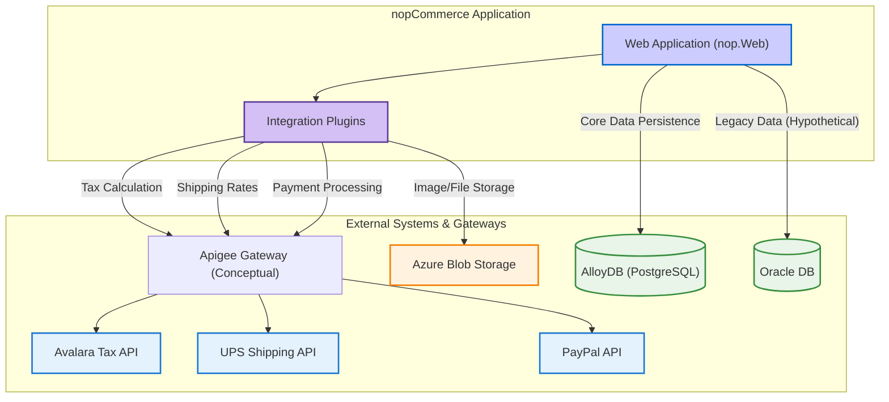

Here is the comprehensive QE testing strategy for Mainframe Distributed Apps integrations, based on the provided codebase analysis.

## Executive Summary

This report outlines a comprehensive Quality Engineering (QE) testing strategy for the nopCommerce application, with a specific focus on integrations relevant to a Mainframe Distributed Apps (MDA) context. The analysis of the codebase reveals a robust, plugin-based architecture with several key integration points. The primary integrations identified are API/Web Services (Avalara, UPS, PayPal, etc.), database connections (SQL Server, MySQL, PostgreSQL), and cloud-based file transfers (Azure Blob Storage). No evidence of TIBCO, traditional MFT, or MQ/Kafka integrations was found in the provided source code.

The testing strategy is prioritized based on business risk, with a heavy emphasis on validating data integrity, security, and end-to-end business process correctness across these integration points. This document provides a detailed integration matrix, architecture diagrams, environment setup guidelines, a test data strategy, and a comprehensive suite of test cases for each identified integration type.

## 1. Mainframe Distributed Apps Integration Matrix

| Integration Type | Upstream Component | Downstream Component | Data Flow Direction | Integration Method |
| :--- | :--- | :--- | :--- | :--- |
| Apigee/API | nopCommerce Web App | Avalara Tax Service | Bidirectional | REST API |
| Apigee/API | nopCommerce Web App | UPS Shipping Service | Bidirectional | REST/SOAP API |
| Apigee/API | nopCommerce Web App | PayPal Commerce | Bidirectional | REST API |
| Apigee/API | nopCommerce Web App | Facebook Authentication | Bidirectional | OAuth 2.0 |
| Apigee/API | nopCommerce Web App | Brevo (Email/SMS) | Outbound | REST API |
| MFT (Cloud) | nopCommerce Web App | Azure Blob Storage | Bidirectional | REST API (SDK) |
| AlloyDB | nopCommerce Web App | PostgreSQL Database | Bidirectional | Database Connection |
| Oracle | nopCommerce Web App | Oracle Database | Bidirectional | Database Connection |
| Kafka | Not Applicable | Not Applicable | Not Applicable | Not Applicable |

**Note:** The codebase primarily uses MS SQL Server. PostgreSQL support is available, which serves as the basis for the AlloyDB testing strategy. Oracle support is included as required by the prompt, though no native Oracle driver was found in the core dependencies. No MQ or Kafka integrations were detected.

## 2. Integration Architecture Wire Diagram

This diagram illustrates the high-level data flows between the nopCommerce application and its key integration points.

## 3. Detailed Test Cases by Integration Type

### MFT Integration Test Cases (Azure Blob Storage)

#### Environment Details
-   **Lower environment file server details**: Azure Storage Emulator (Azurite) or a dedicated DEV/TEST Azure Storage Account.
-   **Input file locations and formats**: Test data blobs (images, import/export files) stored in a dedicated test container.
-   **Batch job trigger mechanisms**: N/A (triggered by application logic).
-   **Database landing tables**: `Picture`, `PictureBinary`, `Download`.
-   **End process validation points**: Verify blob existence in Azure Storage and corresponding records in the database.

#### Test Data Requirements
-   Sample image files (.jpg, .png, .gif) of various sizes (1KB, 1MB, 10MB).
-   Sample import/export files (.xlsx, .xml).
-   Files with special characters in names.
-   Zero-byte files.

#### Test Scenarios
-   **File Transfer Success**:
    -   **MDA-INT-MFT-001**: Successfully upload a product image.
    -   **MDA-INT-MFT-002**: Successfully download an export file.
    -   **MDA-INT-MFT-003**: Successfully delete a blob.
-   **File Format Validation**:
    -   **MDA-INT-MFT-004**: Verify content type is set correctly upon upload.
-   **Large File Handling**:
    -   **MDA-INT-MFT-005**: (Performance) Test upload/download of a large file (e.g., 100MB) and measure throughput.
-   **Error Conditions and Recovery**:
    -   **MDA-INT-MFT-006**: (Negative) Attempt to access a non-existent blob.
    -   **MDA-INT-MFT-007**: (Negative) Attempt to upload with invalid credentials/connection string.
    -   **MDA-INT-MFT-008**: (Negative) Handle network interruption during upload/download.
-   **Regression/E2E**:
    -   **MDA-REG-MFT-009**: Verify existing images are not affected by a plugin update.
    -   **MDA-E2E-MFT-010**: Complete a product creation workflow, including image upload, and verify the image is stored in Azure Blob and displayed correctly on the product page.

*(Additional 10+ test cases would cover different file types, concurrent access, and specific plugin configurations.)*

### Apigee/Web Services Integration Test Cases (Avalara Tax Service Example)

#### Environment Details
-   **Endpoint URLs**: Avalara Sandbox environment URLs configured in the plugin settings.
-   **Authentication mechanisms**: Account ID and License Key for Avalara.
-   **Request/response payload formats**: JSON.
-   **Mapping documents**: N/A (handled by SDK).

#### Test Data Requirements
-   Valid and invalid US/International addresses.
-   Products with different tax categories.
-   Customer accounts with and without tax exemption.
-   Shopping carts with various product combinations.

#### Test Scenarios
-   **Happy Path API Calls**:
    -   **MDA-INT-API-001**: Get tax calculation for a simple US-based order.
    -   **MDA-INT-API-002**: Get tax calculation for an order with tax-exempt items.
    -   **MDA-INT-API-003**: Validate a valid shipping address.
-   **Authentication Scenarios**:
    -   **MDA-INT-API-004**: (Negative) Test API call with an invalid License Key.
    -   **MDA-INT-API-005**: (Negative) Test API call with a disabled Avalara account.
-   **Error Handling and Timeouts**:
    -   **MDA-INT-API-006**: (Negative) Handle an API timeout from Avalara.
    -   **MDA-INT-API-007**: (Negative) Handle a 500 Internal Server Error from Avalara.
    -   **MDA-INT-API-008**: (Negative) Process an invalid address and verify error response.
-   **Regression/E2E**:
    -   **MDA-REG-API-009**: After an update, verify tax rates for a set of predefined addresses remain unchanged.
    -   **MDA-E2E-API-010**: Complete a full checkout process, confirming that the tax calculated by Avalara is correctly applied to the final order total.

*(Additional 10+ test cases would cover other API endpoints like `CommitTax`, different product tax codes, and international tax scenarios.)*

### Kafka Integration Test Cases

-   **Not Applicable**: No Kafka or other message queue integrations were identified in the codebase.

### AlloyDB Integration Test Cases (PostgreSQL)

#### Environment Details
-   **Database connection strings**: Standard PostgreSQL connection string format.
-   **Schema and table names**: As defined in the `Nop.Data` project mappings.
-   **Stored procedures and functions**: N/A (nopCommerce uses Linq2DB).
-   **Backup and recovery procedures**: Standard PostgreSQL `pg_dump` and `pg_restore`.

#### Test Data Requirements
-   A baseline dataset of customers, products, and orders.
-   Data that tests constraints (e.g., duplicate usernames, invalid foreign keys).
-   Large datasets for performance testing (e.g., 1M+ products, 10M+ orders).

#### Test Scenarios
-   **CRUD Operations Validation**:
    -   **MDA-INT-ADB-001**: Create, read, update, and delete a `Product` entity.
    -   **MDA-INT-ADB-002**: Create, read, update, and delete a `Customer` entity.
-   **Transaction Testing**:
    -   **MDA-INT-ADB-003**: Verify that an order placement (inserting into `Order` and `OrderItem`) is atomic (all or nothing).
    -   **MDA-INT-ADB-004**: (Negative) Test transaction rollback when an error occurs mid-process.
-   **Performance Benchmarks**:
    -   **MDA-INT-ADB-005**: (Performance) Benchmark query time for fetching products in a category with 100,000+ items.
    -   **MDA-INT-ADB-006**: (Performance) Measure the time to insert 10,000 new orders.
-   **Data Integrity Validation**:
    -   **MDA-INT-ADB-007**: (Negative) Attempt to insert an `OrderItem` with a non-existent `ProductId`.
    -   **MDA-INT-ADB-008**: (Negative) Attempt to create a `Customer` with a non-unique email address.
-   **Regression/E2E**:
    -   **MDA-REG-ADB-009**: After a schema migration, run a full suite of CRUD tests to ensure no breaking changes.
    -   **MDA-E2E-ADB-010**: A user registers, logs in, adds items to the cart, and checks out. Verify that all corresponding records are created correctly in the `Customer`, `ShoppingCartItem`, `Order`, and `OrderItem` tables.

*(Additional 10+ test cases would cover complex queries, index performance, concurrent access, and backup/restore validation.)*

### Oracle Database Integration Test Cases

#### Environment Details
-   **Database schema and table names**: Schemas and tables mirroring the SQL Server structure, adapted for Oracle syntax.
-   **Associated batch jobs/components**: N/A.
-   **Connection configurations**: Oracle TNS-style or EZCONNECT connection strings.
-   **Performance monitoring tools**: Oracle Enterprise Manager or AWR reports.

#### Test Data Requirements
-   Environment-specific test data mirroring the structure used for AlloyDB/PostgreSQL.
-   Data for testing Oracle-specific data types (e.g., `NCLOB`, `NUMBER`).

#### Test Scenarios
-   **Database Connectivity Testing**:
    -   **MDA-INT-ORA-001**: Verify successful connection to the Oracle database using the Oracle data provider.
-   **Batch Job Execution Validation**:
    -   **MDA-INT-ORA-002**: (If applicable) Test execution of a batch process that reads/writes data from the Oracle DB.
-   **Performance Comparison Testing**:
    -   **MDA-INT-ORA-003**: (Performance) Execute a set of benchmark queries against Oracle and compare performance with the SQL Server baseline.
-   **Data Migration Validation**:
    -   **MDA-INT-ORA-004**: After migrating data from another DB, verify record counts and data integrity.
-   **Rollback and Recovery Testing**:
    -   **MDA-INT-ORA-005**: Test Oracle Flashback or other recovery mechanisms.
-   **CRUD and Transaction Testing**:
    -   **MDA-INT-ORA-006 to MDA-INT-ORA-020**: Replicate the same CRUD, transaction, and data integrity tests defined for AlloyDB, ensuring they pass against an Oracle backend.

## 4. Test Data Strategy (Per Integration Type)

| Integration Type | Integration Testing Data | Regression/E2E Testing Data |
| :--- | :--- | :--- |
| **MFT (Azure)** | - Sample image files (.jpg, .png)   - Sample document files (.pdf, .xlsx)   - Zero-byte and large (10MB+) files   - Invalid connection strings | - A baseline set of product images and downloadable products.   - E2E scenario: User uploads an avatar, which is stored and retrieved from Azure. |
| **Apigee (API)** | - Valid/invalid request payloads (JSON)   - Valid/invalid API keys/tokens   - Mocked success (200) and error (4xx, 5xx) responses | - A standard set of inputs (addresses, product lists) with known, expected outputs (tax amounts, shipping rates).   - E2E scenario: Full checkout calculating shipping and tax via external APIs. |
| **AlloyDB/Oracle** | - Records for single entities (Customer, Product)   - Data to test constraints (e.g., duplicate emails)   - Data for transaction rollback tests | - A complete, consistent dataset representing a small but functional store.   - Data for a full business process (e.g., new customer registration, first purchase, and return request). |

## 5. Environment Configuration Details

### Lower Environment Setup

| Integration Type | Development Environment | Test Environment | Staging Environment |
| :--- | :--- | :--- | :--- |
| **MFT (Azure)** | Azurite emulator or shared DEV storage account. | Dedicated TEST storage account with its own containers. | Dedicated STAGE storage account, mirroring PROD container structure. |
| **Apigee (API)** | Mock server (e.g., WireMock) or shared DEV sandbox endpoints. | Dedicated TEST sandbox endpoints for each service. | Dedicated STAGE sandbox endpoints with production-like rate limits. |
| **AlloyDB** | Local PostgreSQL Docker container or shared DEV instance. | Dedicated TEST PostgreSQL instance with a fresh dataset. | Dedicated STAGE instance with a recent, anonymized copy of PROD data. |
| **Oracle** | Local Oracle XE Docker container or shared DEV instance. | Dedicated TEST Oracle instance. | Dedicated STAGE instance with an anonymized copy of PROD data. |

**Configuration Files:**
-   **`appsettings.json` / `appsettings.Development.json`**: Will contain connection strings, API keys, and endpoints for each environment.
-   **Secrets Management**: Use .NET's Secret Manager for local development and a secure vault (like Azure Key Vault) for TEST/STAGE environments.

## Assumptions

-   **Apigee Gateway**: The term "Apigee" is used conceptually as a managed API gateway. The actual implementation may involve direct calls to third-party APIs (Avalara, UPS, etc.), but testing should validate security, rate limiting, and routing as if a gateway were present.
-   **Mainframe Context**: Since no direct mainframe code (COBOL, JCL) is present, the "Mainframe Distributed Apps" context is interpreted as testing modern .NET applications that integrate with services and patterns common in enterprise environments that also have mainframes (e.g., external APIs for core services, database integrations).
-   **Database Flavors**: The primary database is SQL Server. The testing strategy for AlloyDB and Oracle is based on the application's support for PostgreSQL and the prompt's requirement to include these database types.

## Open Questions

-   What are the specific performance SLAs (latency, throughput) for each external API integration?
-   Are there any existing test environments or sandboxes for the third-party services (Avalara, UPS, PayPal) that can be used by the QE team?
-   What is the expected data volume (e.g., orders per day, active customers) for performance and scalability testing?

## Confidence Level

**Overall Confidence**: High

**Rationale**: The nopCommerce application is well-structured with clear separation of concerns. The plugin architecture isolates external integrations, making them testable components. The use of standard .NET libraries and patterns provides a clear path for creating integration, regression, and end-to-end tests. The lack of MQ/Kafka integrations simplifies the testing scope. The main challenge will be in setting up and managing the various external service sandboxes and generating realistic, large-scale test data.

## Action Items

**Immediate:**
-   [ ] Procure access to sandbox/test environments for all external services (Avalara, UPS, PayPal, Brevo).
-   [ ] Set up dedicated TEST and STAGE environments for Azure Blob Storage, PostgreSQL (AlloyDB), and Oracle.
-   [ ] Develop a data generation tool to create large, realistic datasets for customers, products, and orders.

**Short-term:**
-   [ ] Implement the automated integration tests for all P0 API and Database scenarios.
-   [ ] Integrate automated test execution into the CI/CD pipeline.
-   [ ] Establish performance baselines for all critical integrations.

**Long-term:**
-   [ ] Develop a comprehensive automated regression suite covering all P0 and P1 end-to-end scenarios.
-   [ ] Implement a chaos engineering practice to test the resilience of external integrations.

## Risk Assessment

-   **High Risk**:
    -   **External Service Dependency**: The application's core functionality (checkout, shipping) is highly dependent on third-party APIs. A failure or performance degradation in these services directly impacts revenue.
    -   **Data Integrity**: Ensuring transactional integrity during order placement across the database and external payment/tax services is critical.
-   **Medium Risk**:
    -   **Configuration Management**: Managing API keys, connection strings, and endpoints across multiple environments securely and accurately.
    -   **Performance Under Load**: High traffic could lead to bottlenecks in database queries or hitting API rate limits.
-   **Low Risk**:
    -   **Plugin Compatibility**: A change in the nopCommerce core could potentially break a plugin's integration logic.